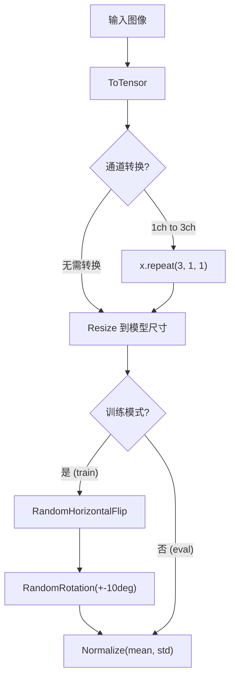

# 数据管道

## 数据流概览

数据管道采用**注册表驱动**的架构，根据用户选择的模型和数据集自动适配所有参数：

```
用户选择 --model + --dataset
        │
        ▼
┌─────────────────────────┐
│ 查询两个注册表          │
│  get_model_info()       │  → input_size, channels
│  get_dataset_info()     │  → channels, num_classes, image_size, mean, std, kwargs
└───────────┬─────────────┘
            │
            ▼
┌─────────────────────────┐
│ build_transform()       │  自适应预处理管线
│  → ToTensor             │
│  → [通道转换 如需]      │
│  → Resize (模型尺寸)    │
│  → [数据增强 仅训练]    │
│  → Normalize            │
└───────────┬─────────────┘
            │
            ▼
┌─────────────────────────┐
│ build_dataloaders()     │
│  → torchvision 数据集类 │
│  → train/val/test 分割  │
│  → DataLoader 包装      │
└───────────┬─────────────┘
            │
            ▼
     train_loader, val_loader, test_loader
```



---

## 自适应 Transform 管线

**源码**: [cnnlib/data/transform.py](https://github.com/NayukiChiba/ALL-CNN/blob/main/cnnlib/data/transform.py)

### build_transform() 函数

```python
def build_transform(model_name: str, dataset_name: str, augment: bool = False):
    model_info = get_model_info(model_name)
    dataset_info = get_dataset_info(dataset_name)

    pipeline = [ToTensor()]

    # 通道转换
    if dataset_info["channels"] == 1 and model_info["channels"] == 3:
        pipeline.append(Lambda(lambda x: x.repeat(3, 1, 1)))

    # 尺寸缩放
    pipeline.append(Resize((model_info["input_size"], model_info["input_size"])))

    # 数据增强（仅训练）
    if augment:
        pipeline.append(RandomHorizontalFlip())
        pipeline.append(RandomRotation(degrees=10))

    # 归一化
    pipeline.append(Normalize(mean=dataset_info["mean"], std=dataset_info["std"]))

    return Compose(pipeline)
```

### 五步管线详解

#### 1. ToTensor

将 PIL Image `(H, W)` uint8 [0, 255] 转换为 Tensor `(C, H, W)` float32 [0, 1]：

$$\text{tensor} = \frac{\text{pil\_image}}{255.0}$$

#### 2. 通道转换（按需）

当数据集是灰度图（1 通道）但模型期望 RGB（3 通道）时，将灰度图复制到 3 个通道：

```python
x = x.repeat(3, 1, 1)  # (1, H, W) → (3, H, W)
```

**适用场景**: LeNet（期望 1 通道）训练 MNIST 时无需转换；AlexNet（期望 3 通道）训练 MNIST 时需转换。


#### 3. Resize 尺寸缩放

将图像缩放到模型期望的输入尺寸。例如 MNIST 原始 28×28，但 LeNet 期望 32×32——自动 Resize 到 32×32。

#### 4. 数据增强（仅训练时）

训练模式下追加两个随机变换：

- **RandomHorizontalFlip(p=0.5)**: 50% 概率水平翻转，增强左右不变性
- **RandomRotation(degrees=10)**: 随机旋转 ±10°，增强旋转不变性

验证和测试管线**不包含**数据增强，保证评估的确定性。


#### 5. Normalize（Z-score 标准化）

使用数据集特定的均值和标准差进行 Z-score 标准化：

$$\text{normalized}_c = \frac{x_c - \mu_c}{\sigma_c}$$

每个数据集使用其在训练集上预计算的全局统计量（见下文归一化统计量表）。

---

## 10 个数据集归一化统计量

| 数据集 | 通道 | 均值 (μ) | 标准差 (σ) |
|--------|------|---------|-----------|
| MNIST | 1 | (0.1307,) | (0.3081,) |
| FashionMNIST | 1 | (0.2860,) | (0.3530,) |
| EMNIST | 1 | (0.1736,) | (0.3317,) |
| CIFAR-10 | 3 | (0.4914, 0.4822, 0.4465) | (0.2470, 0.2435, 0.2616) |
| CIFAR-100 | 3 | (0.5071, 0.4867, 0.4408) | (0.2675, 0.2565, 0.2761) |
| SVHN | 3 | (0.4377, 0.4438, 0.4728) | (0.1980, 0.2010, 0.1970) |
| STL-10 | 3 | (0.4467, 0.4398, 0.4066) | (0.2603, 0.2566, 0.2713) |
| Caltech-101 | 3 | (0.485, 0.456, 0.406) | (0.229, 0.224, 0.225) |
| GTSRB | 3 | (0.3403, 0.3121, 0.3214) | (0.2724, 0.2608, 0.2669) |
| Flowers-102 | 3 | (0.485, 0.456, 0.406) | (0.229, 0.224, 0.225) |

> Caltech-101 和 Flowers-102 使用 ImageNet 统计量（其自身统计量未广泛发布）。

---

## 数据加载器

**源码**: [cnnlib/data/loader.py](https://github.com/NayukiChiba/ALL-CNN/blob/main/cnnlib/data/loader.py)

### build_dataloaders() 函数

```python
def build_dataloaders(model_name, dataset_name, batch_size, val_split,
                      num_workers, pin_memory, data_dir, seed):
    # 1. 获取数据集信息
    dataset_info = get_dataset_info(dataset_name)

    # 2. 创建 transform
    train_transform = build_transform(model_name, dataset_name, augment=True)
    eval_transform = build_transform(model_name, dataset_name, augment=False)

    # 3. 加载 torchvision 数据集
    train_dataset = torchvision_dataset(root=data_dir, transform=train_transform, **train_kwargs)
    test_dataset = torchvision_dataset(root=data_dir, transform=eval_transform, **test_kwargs)

    # 4. 训练/验证分割（确定性）
    generator = torch.Generator().manual_seed(seed)
    train_subset, val_subset = random_split(train_dataset, [n_train, n_val], generator)

    # 5. 包装 DataLoader
    train_loader = DataLoader(train_subset, batch_size=batch_size, shuffle=True, ...)
    val_loader = DataLoader(val_subset, batch_size=batch_size, shuffle=False, ...)
    test_loader = DataLoader(test_dataset, batch_size=batch_size, shuffle=False, ...)

    return train_loader, val_loader, test_loader
```

### torchvision 数据集类映射

数据加载器根据数据集名称自动选择对应的 torchvision 类：

| 数据集 | torchvision 类 | 特殊构造参数 |
|--------|---------------|-------------|
| MNIST | `datasets.MNIST` | `train=True/False` |
| FashionMNIST | `datasets.FashionMNIST` | `train=True/False` |
| EMNIST | `datasets.EMNIST` | `split="balanced"` |
| CIFAR-10 | `datasets.CIFAR10` | `train=True/False` |
| CIFAR-100 | `datasets.CIFAR100` | `train=True/False` |
| SVHN | `datasets.SVHN` | `split="train"/"test"` |
| STL-10 | `datasets.STL10` | `split="train"/"test"` |
| Caltech-101 | `datasets.Caltech101` | 无特殊参数 |
| GTSRB | `datasets.GTSRB` | `split="train"/"test"` |
| Flowers-102 | `datasets.Flowers102` | `split="train"/"test"` |

---

## 训练/验证/测试分割

### 三层 DataLoader

| DataLoader | 样本来源 | Shuffle | 数据增强 | 用途 |
|-----------|---------|---------|---------|------|
| `train_loader` | 原始训练集的 90% | True | 水平翻转 + 旋转 | 模型参数更新 |
| `val_loader` | 原始训练集的 10% | False | 无 | 每 epoch 验证 + 早停 + 调度器 |
| `test_loader` | 原始测试集 100% | False | 无 | 最终评估 |

### 确定性分割

使用固定种子的 `torch.Generator` 确保每次运行分割结果一致：

```python
generator = torch.Generator().manual_seed(seed)
indices = torch.randperm(len(train_dataset), generator=generator)
```

默认 `val_split = 0.1`，即从训练集中分出 10% 作为验证集。

### 特殊情况

| 数据集 | 处理方式 |
|--------|---------|
| Caltech-101 | 无内置 train/test 分集，全量加载后由 `random_split` 按 `val_split` 切分 |
| Flowers-102 | 使用 `split="train"` 加载训练集，`split="test"` 加载测试集；训练集进一步切出验证集 |

---

## DataLoader 配置

**配置来源**: [config/data.py](https://github.com/NayukiChiba/ALL-CNN/blob/main/config/data.py) — `DataParams`

| 参数 | 默认值 | 说明 |
|------|--------|------|
| `BATCH_SIZE` | 64 | 每批 64 张图 |
| `NUM_WORKERS` | 4 | 4 个子进程并行加载数据 |
| `PIN_MEMORY` | True | 锁页内存，加速 CPU→GPU 传输 |
| `VAL_SPLIT` | 0.1 | 验证集占训练集的比例 |

`pin_memory=True` 对 GPU 训练至关重要——数据从 CPU 到 GPU 的传输可以在后台异步完成，与 GPU 前向/反向计算时间重叠。

---

## 通道兼容性矩阵

以下矩阵展示各模型 × 数据集组合的通道适配需求：

| 模型 \ 数据集 | MNIST (1ch) | FMNIST (1ch) | EMNIST (1ch) | CIFAR10 (3ch) | CIFAR100 (3ch) | SVHN (3ch) | STL10 (3ch) | Caltech101 (3ch) | GTSRB (3ch) | Flowers102 (3ch) |
|------|:--:|:--:|:--:|:--:|:--:|:--:|:--:|:--:|:--:|:--:|
| LeNet (1ch) | 直通 | 直通 | 直通 | ❌ | ❌ | ❌ | ❌ | ❌ | ❌ | ❌ |
| AlexNet (3ch) | 转换 | 转换 | 转换 | 直通 | 直通 | 直通 | 直通 | 直通 | 直通 | 直通 |
| VGG11-19 (3ch) | 转换 | 转换 | 转换 | 直通 | 直通 | 直通 | 直通 | 直通 | 直通 | 直通 |
| NiN (3ch) | 转换 | 转换 | 转换 | 直通 | 直通 | 直通 | 直通 | 直通 | 直通 | 直通 |
| GoogLeNet (3ch) | 转换 | 转换 | 转换 | 直通 | 直通 | 直通 | 直通 | 直通 | 直通 | 直通 |

- **直通**: 数据集通道数 = 模型期望通道数，无需转换
- **转换**: 1ch → 3ch 通过 `x.repeat(3, 1, 1)` 自动转换
- **❌**: 模型为 1ch 但数据集为 3ch，不支持（LeNet 设计上不接受 RGB 输入）

---

## 各数据集详解

### MNIST

- **来源**: LeCun et al., 1998. 手写数字 0-9.
- **样本数**: 60,000 训练 + 10,000 测试
- **图像**: 灰度 28×28，数字居中，背景黑色
- **类别**: 10（数字 0-9）
- **归一化**: μ=0.1307, σ=0.3081


### FashionMNIST

- **来源**: Xiao et al., 2017. Zalando 服饰图片，作为 MNIST 的更难替代品.
- **样本数**: 60,000 训练 + 10,000 测试
- **图像**: 灰度 28×28
- **类别**: 10（T恤、裤子、套头衫、连衣裙、外套、凉鞋、衬衫、运动鞋、包、短靴）

### EMNIST

- **来源**: Cohen et al., 2017. NIST 手写字符扩展版.
- **样本数**: 112,800 训练 + 18,800 测试（balanced split）
- **图像**: 灰度 28×28
- **类别**: 47（10 数字 + 26 大写字母 + 11 小写字母合并）
- **特殊**: 需要 `split="balanced"` 参数

### CIFAR-10

- **来源**: Krizhevsky, 2009. 自然图像小尺寸基准.
- **样本数**: 50,000 训练 + 10,000 测试
- **图像**: RGB 32×32
- **类别**: 10（飞机、汽车、鸟、猫、鹿、狗、青蛙、马、船、卡车）

### CIFAR-100

- **来源**: Krizhevsky, 2009. CIFAR-10 的细粒度版本.
- **样本数**: 50,000 训练 + 10,000 测试
- **图像**: RGB 32×32
- **类别**: 100（20 个超类别，每个含 5 个子类别）

### SVHN

- **来源**: Netzer et al., 2011. Google 街景门牌号码.
- **样本数**: 73,257 训练 + 26,032 测试 + 531,131 额外
- **图像**: RGB 32×32（从原始大图中裁剪）
- **类别**: 10（数字 0-9）
- **特殊**: 使用 `split="train"/"test"` 而非 `train=True/False`

### STL-10

- **来源**: Coates et al., 2011. 受 CIFAR-10 启发但分辨率更高.
- **样本数**: 5,000 训练 + 8,000 测试 + 100,000 无标签
- **图像**: RGB 96×96
- **类别**: 10（与 CIFAR-10 相同类别）
- **特殊**: 训练集较小（5,000），适合测试迁移学习和半监督方法

### Caltech-101

- **来源**: Fei-Fei et al., 2004. 物体识别基准.
- **样本数**: ~9,000 张（各类别 40~800 张不等）
- **图像**: RGB 可变尺寸
- **类别**: 101（含一个背景类别）
- **特殊**: 无内置 train/test 分集，使用 ImageNet 归一化统计量

### GTSRB

- **来源**: Stallkamp et al., 2011. 德国交通标志识别基准.
- **样本数**: 39,209 训练 + 12,630 测试
- **图像**: RGB 可变尺寸（15×15 ~ 250×250）
- **类别**: 43（各类交通标志）
- **特殊**: 使用 `split="train"/"test"`，尺寸差异大需统一 Resize

### Flowers-102

- **来源**: Nilsback & Zisserman, 2008. 牛津花卉数据集.
- **样本数**: 6,149（train+val+test 按官方分割）
- **图像**: RGB 可变尺寸
- **类别**: 102（各类花卉）
- **特殊**: 使用 `split="train"/"val"/"test"`，使用 ImageNet 归一化统计量

---

## 源码位置

- Transform 管线: [cnnlib/data/transform.py](https://github.com/NayukiChiba/ALL-CNN/blob/main/cnnlib/data/transform.py)
- 数据加载器: [cnnlib/data/loader.py](https://github.com/NayukiChiba/ALL-CNN/blob/main/cnnlib/data/loader.py)
- 数据集注册表: [cnnlib/registry/datasets.py](https://github.com/NayukiChiba/ALL-CNN/blob/main/cnnlib/registry/datasets.py)
- DataLoader 配置: [config/data.py](https://github.com/NayukiChiba/ALL-CNN/blob/main/config/data.py)
