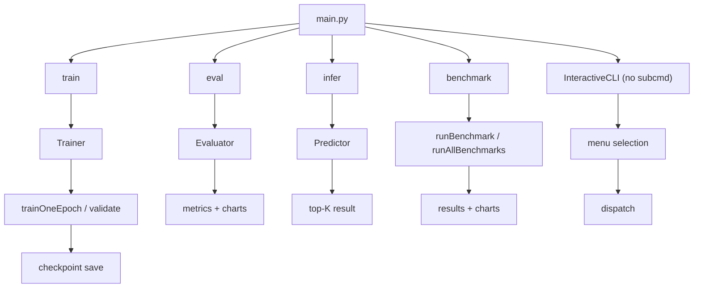

# 项目总体架构

## 目录结构

```
ALL-CNN/
├── main.py                       # 唯一入口，子命令分发
├── pyproject.toml                # 项目元数据、依赖、Ruff 配置
│
├── config/                       # 配置层
│   ├── defaults.py               # DefaultParams: SEED=42, DEVICE 自动检测
│   ├── data.py                   # DataParams: BATCH_SIZE, NUM_WORKERS, VAL_SPLIT
│   ├── training.py               # TrainingParams: epochs, optimizer, lr, scheduler
│   └── paths.py                  # 项目路径常量 + 运行时路径函数
│
├── cnnlib/                       # 核心库
│   ├── cli/                      # CLI 层
│   │   ├── parser.py             # argparse 解析器（全局参数 + 4 子命令）
│   │   └── interactive.py        # 交互式 TUI 菜单（ANSI 配色）
│   │
│   ├── data/                     # 数据层
│   │   ├── loader.py             # build_dataloaders() — 数据集加载 + train/val/test 分割
│   │   └── transform.py          # build_transform() — 自适应预处理管线
│   │
│   ├── evaluation/               # 评估层
│   │   ├── evaluator.py          # Evaluator 类 — 全量评估 + per-class 分析
│   │   ├── metrics.py            # 指标函数 — accuracy, top-K, 混淆矩阵, F1
│   │   └── visualize.py          # 可视化 — 混淆矩阵热力图, 训练曲线, per-class 柱状图
│   │
│   ├── experiments/              # 实验层
│   │   └── benchmark.py          # runBenchmark / runAllBenchmarks + 对比图表
│   │
│   ├── inference/                # 推理层
│   │   └── predictor.py          # Predictor 类 — 单图/批量/文件推理, top-K 输出
│   │
│   ├── models/                   # 模型层
│   │   ├── base.py               # BaseModel(nn.Module) — 公共基类
│   │   ├── blocks.py             # 公共构建块 — conv_block, linear_block, inception_block, nin_block, vgg_conv
│   │   ├── factory.py            # create_model / create_model_for_dataset
│   │   ├── lenet.py              # LeNet-5 (1998)
│   │   ├── alexnet.py            # AlexNet (2012)
│   │   ├── vgg.py                # VGG11, VGG13, VGG16, VGG19 (2015)
│   │   ├── nin.py                # NiN — Network in Network (2014)
│   │   └── googlenet.py          # GoogLeNet / Inception v1 (2015)
│   │
│   ├── registry/                 # 注册层
│   │   ├── models.py             # @register_model 装饰器 + list_models + get_model_info
│   │   └── datasets.py           # 数据集注册表（10 个条目，含 channels/num_classes/mean/std/kwargs）
│   │
│   └── training/                 # 训练层
│       ├── trainer.py            # Trainer 类 — 完整训练编排器
│       ├── engine.py             # trainOneEpoch / validate 核心循环
│       ├── loss.py               # createLoss — 损失函数工厂
│       ├── optimizer.py          # createOptimizer — 优化器工厂 (Adam/AdamW/SGD/RMSprop)
│       ├── scheduler.py          # createScheduler — 调度器工厂 (Plateau/Step/Cosine/CosineWarm)
│       ├── earlyStopping.py      # EarlyStopping — 早停机制
│       ├── checkpoint.py         # saveCheckpoint / loadCheckpoint
│       └── logger.py             # TrainingLogger — 控制台+文件+TensorBoard 三通道
│
├── scripts/                      # 流水线脚本
│   ├── train.py                  # 训练流水线
│   ├── eval.py                   # 评估流水线
│   ├── infer.py                  # 推理流水线
│   └── benchmark.py              # 基准测试流水线
│
├── tests/                        # 测试
│   ├── test_models.py            # 8 模型 + registry + factory + VGG 变体
│   ├── test_data.py              # 10 数据集 + registry + transform + DataLoader
│   ├── test_training.py          # loss/optimizer/scheduler/earlystop/checkpoint/logger/engine/Trainer
│   ├── test_evaluation.py        # metrics/Evaluator/visualize
│   ├── test_inference.py         # Predictor (PIL/numpy/tensor/batch/file)
│   ├── test_interactive.py       # InteractiveCLI
│   └── test_end_to_end.py        # 8 模型 × 10 数据集交叉验证
│
├── datasets/                     # 数据集（自动下载）
├── checkpoints/                  # 检查点（按 模型/数据集 分层）
│   ├── lenet/mnist/
│   ├── alexnet/cifar10/
│   └── ...
├── outputs/                      # 产物
│   ├── logs/{model}/{dataset}/       # TensorBoard 日志
│   └── visuals/{model}/{dataset}/    # 可视化图表
└── docs/                         # 本文档（VitePress）
```


---

## 模块职责表

| 模块 | 职责 | 关键入口 |
|------|------|---------|
| `config/` | 超参数默认值、路径常量 | `defaults.py`, `data.py`, `training.py`, `paths.py` |
| `cnnlib/registry/` | 模型注册表 + 数据集注册表，提供查询接口 | `models.py:31-56`, `datasets.py:25-128` |
| `cnnlib/models/` | 模型类定义 + 公共构建块 + 工厂函数 | `factory.py:create_model`, `blocks.py` |
| `cnnlib/data/` | 自适应数据加载、transform 管线、train/val/test 分割 | `loader.py:build_dataloaders`, `transform.py:build_transform` |
| `cnnlib/training/` | 训练引擎、损失/优化器/调度器工厂、早停、检查点、日志 | `trainer.py:Trainer`, `engine.py:trainOneEpoch` |
| `cnnlib/evaluation/` | 评估器、全量指标计算、可视化图表生成 | `evaluator.py:Evaluator`, `metrics.py:computeAllMetrics` |
| `cnnlib/inference/` | 多格式推理预测器 | `predictor.py:Predictor` |
| `cnnlib/experiments/` | 跨模型/数据集基准测试 | `benchmark.py:runAllBenchmarks` |
| `cnnlib/cli/` | 命令行解析 + 交互式 TUI | `parser.py:buildParser`, `interactive.py:InteractiveCLI` |
| `scripts/` | 流水线编排，串联各模块 | `train.py`, `eval.py`, `infer.py`, `benchmark.py` |
| `main.py` | 唯一入口，解析 CLI → 设置种子 → 分发子命令 | `main.py:main()` |

---

## 数据流

```
python main.py [全局参数] <子命令> [子命令参数]
        │
        ▼
cnnlib/cli/parser.py  ←── 解析 CLI 参数（argparse）
        │
        ▼
main.py  ←── 设置随机种子（Python/NumPy/PyTorch）→ 分发子命令
        │
        ├── train → scripts/train.py
        │       ├── cnnlib/models/factory.py       → create_model_for_dataset()
        │       ├── cnnlib/data/loader.py           → build_dataloaders()
        │       ├── cnnlib/training/optimizer.py    → createOptimizer()
        │       ├── cnnlib/training/scheduler.py    → createScheduler()
        │       ├── cnnlib/training/loss.py         → createLoss()
        │       ├── cnnlib/training/logger.py       → TrainingLogger
        │       ├── cnnlib/training/earlyStopping.py → EarlyStopping
        │       ├── cnnlib/training/trainer.py      → Trainer (编排)
        │       │       ├── cnnlib/training/engine.py  → trainOneEpoch / validate
        │       │       └── cnnlib/training/checkpoint.py → saveCheckpoint
        │       └── cnnlib/evaluation/visualize.py  → generateAllCharts()
        │
        ├── eval  → scripts/eval.py
        │       ├── cnnlib/data/loader.py           → test DataLoader
        │       ├── cnnlib/training/checkpoint.py   → loadCheckpoint
        │       ├── cnnlib/evaluation/evaluator.py  → Evaluator.evaluate()
        │       └── cnnlib/evaluation/visualize.py  → generateAllCharts()
        │
        ├── infer → scripts/infer.py
        │       ├── cnnlib/data/transform.py        → build_transform (no augment)
        │       ├── cnnlib/training/checkpoint.py   → loadCheckpoint
        │       └── cnnlib/inference/predictor.py   → Predictor.predict()
        │
        ├── benchmark → scripts/benchmark.py
        │       └── cnnlib/experiments/benchmark.py → runBenchmark / runAllBenchmarks
        │
        └── (无子命令) → cnnlib/cli/interactive.py
                └── InteractiveCLI.run()          → 交互式 TUI 菜单
```



---

## 入口点：main.py

[main.py](https://github.com/NayukiChiba/ALL-CNN/blob/main/main.py) 是整个项目的唯一入口：

```python
def main(argv=None):
    args = getSettings(argv)                    # 解析 CLI
    if args.command is None:
        runInteractive(args)                    # 无子命令 → 交互模式
        return

    random.seed(args.seed)                      # 固定 Python 随机种子
    np.random.seed(args.seed)                   # 固定 NumPy 随机种子
    torch.manual_seed(args.seed)               # 固定 PyTorch 随机种子

    # 子命令分发
    dispatch = {
        "train":    runTrain,
        "eval":     runEval,
        "infer":    runInference,
        "benchmark": runBenchmark,
    }
    dispatch[args.command](args)               # 惰性导入，执行对应流水线
```

四个子命令的 handler 函数都是惰性导入，只在需要时加载对应脚本模块，降低冷启动时间。

---

## 设计原则

### 1. 注册系统解耦

模型和数据集通过独立的注册表管理，互不直接依赖。数据管道通过查询两个注册表自动完成通道转换、尺寸缩放、归一化适配。添加新模型或新数据集无需修改对方代码。

详见 [注册系统](/architecture/registry)

### 2. 配置与代码分离

所有可调参数集中在 `config/` 层，通过 CLI 参数覆盖默认值。`DefaultParams`、`DataParams`、`TrainingParams` 三类配置各司其职。

### 3. 工厂模式

模型、优化器、损失函数、调度器均通过专门的工厂函数创建。工厂函数查询注册表获取元信息，自动填充参数，一步完成实例化和设备迁移。

详见 [模型工厂](/architecture/model-factory)

### 4. 三通道日志

控制台（stderr, INFO）+ 文件（DEBUG）+ TensorBoard（标量曲线 + 模型图），三通道互不干扰。控制台使用 stderr 确保与 tqdm 进度条共存。

### 5. 确定性可复现

固定所有随机种子（Python/NumPy/PyTorch），数据分割使用固定种子的 `torch.Generator`，确保每次运行结果一致。

### 6. 扁平模块结构

`cnnlib/` 下按功能域（data/models/training/evaluation/inference/experiments/cli/registry）平铺，避免深层嵌套。每个模块有清晰的职责边界。

---

## 注册系统快速概览

整个框架的核心是**模型注册表**和**数据集注册表**的完全解耦：

```
@register_model("lenet", input_size=32, channels=1, ...)
class LeNet(BaseModel):           # 模型注册：名字 → {类, 输入尺寸, 通道数}
    ...

datasets = {                       # 数据集注册：名字 → {通道数, 类别数, 均值, 方差, ...}
    "mnist": {"channels": 1, "num_classes": 10, "mean": ..., "std": ...},
    "cifar10": {"channels": 3, "num_classes": 10, "mean": ..., "std": ...},
}

# 自动适配：无论选择哪个模型+数据集组合
model = create_model_for_dataset("lenet", "cifar10")  # 自动 num_classes=10
loader = build_dataloaders(model, "cifar10")           # 自动通道转换 1→3, Resize 28→32
```

任何模型可以配任何数据集——只要注册表中有其元信息。

详见 [注册系统](/architecture/registry)

---

## 项目演进

本项目原名 MNIST-CNN，最初仅支持 2 种模型（ConvBlock 堆叠式 CNN、LeNet-5）和 2 个数据集（MNIST、FashionMNIST）。经重构后更名为 ALL-CNN，扩展至 8 种经典架构和 10 个标准数据集，并引入注册系统、基准测试、交互式 CLI 等完整工程基础设施。
