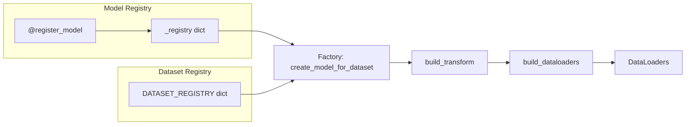

# 注册系统 (Registry)

## 设计动机

当项目支持 N 种模型和 M 个数据集时，如果让模型代码直接硬编码数据集信息（或反过来），会出现 $N \times M$ 种耦合路径。每增加一个模型或数据集，都需要修改多处代码。

注册系统的核心思想：**模型和数据集各自独立注册元信息，数据管道和工厂函数通过查询两个注册表自动适配**。添加新模型只需 3 步，添加新数据集只需 2 步，互不影响。

```
                  ┌──────────────────┐
                  │   Model Registry  │
                  │  name → {class,   │
                  │   input_size,     │
                  │   channels}       │
                  └──────┬───────────┘
                         │ 查询
                         ▼
用户选择 ──→ create_model_for_dataset("vgg16", "cifar10")
                         ▲
                         │ 查询
                  ┌──────┴───────────┐
                  │ Dataset Registry │
                  │  name → {channels,│
                  │   num_classes,    │
                  │   mean, std, ...} │
                  └──────────────────┘
```



---

## 模型注册表

**源码**: [cnnlib/registry/models.py](https://github.com/NayukiChiba/ALL-CNN/blob/main/cnnlib/registry/models.py)

### 注册机制

使用 `@register_model` 装饰器将模型类注册到全局 `_registry` 字典：

```python
_registry: Dict[str, Dict[str, Any]] = {}  # key=模型名称, value={class, input_size, channels, description}

def register_model(name: str, input_size: int, channels: int, description: str = ""):
    """装饰器：将模型类注册到全局注册表"""
    def wrapper(cls: Type[nn.Module]) -> Type[nn.Module]:
        _registry[name] = {
            "class": cls,
            "input_size": input_size,
            "channels": channels,
            "description": description,
        }
        return cls
    return wrapper
```

每个模型在定义时通过装饰器完成注册，例如：

```python
@register_model("lenet", input_size=32, channels=1, description="LeNet-5 (1998)")
class LeNet(BaseModel):
    ...
```

### 已注册模型一览

| 注册名 | 类 | 输入尺寸 | 通道 | 描述 |
|--------|-----|---------|------|------|
| `lenet` | LeNet | 32×32 | 1 | LeNet-5 (1998) |
| `alexnet` | AlexNet | 224×224 | 3 | AlexNet (2012) |
| `vgg11` | VGG11 | 224×224 | 3 | VGG-11 (2015) |
| `vgg13` | VGG13 | 224×224 | 3 | VGG-13 (2015) |
| `vgg16` | VGG16 | 224×224 | 3 | VGG-16 (2015) |
| `vgg19` | VGG19 | 224×224 | 3 | VGG-19 (2015) |
| `nin` | NiN | 32×32 | 3 | Network in Network (2014) |
| `googlenet` | GoogLeNet | 224×224 | 3 | GoogLeNet / Inception v1 (2015) |

### 查询接口

```python
list_models()           # → ['lenet', 'alexnet', 'vgg11', 'vgg13', 'vgg16', 'vgg19', 'nin', 'googlenet']
get_model_info("lenet") # → {"class": LeNet, "input_size": 32, "channels": 1, "description": "..."}
print_registry()        # 打印格式化表格
```

---

## 数据集注册表

**源码**: [cnnlib/registry/datasets.py](https://github.com/NayukiChiba/ALL-CNN/blob/main/cnnlib/registry/datasets.py)

### 注册机制

与模型不同，数据集使用**字典直接注册**（而非装饰器）。这是因为数据集不是类——它们由 torchvision 提供，项目只需记录元信息和特殊构造参数。

```python
datasets: Dict[str, Dict[str, Any]] = {
    "mnist": {
        "channels": 1,
        "num_classes": 10,
        "image_size": 28,
        "mean": (0.1307,),
        "std": (0.3081,),
        "description": "MNIST handwritten digits (10 classes)",
    },
    # ... 其余 9 个数据集
}
```

### 每个条目包含的字段

| 字段 | 类型 | 说明 | 示例 |
|------|------|------|------|
| `channels` | int | 图像通道数（1=灰度, 3=RGB） | 1 |
| `num_classes` | int | 分类类别数 | 10 |
| `image_size` | int \| None | 原始图像尺寸（正方形边长），可变尺寸为 None | 28 |
| `mean` | tuple | 各通道均值（Z-score 归一化） | (0.1307,) |
| `std` | tuple | 各通道标准差（Z-score 归一化） | (0.3081,) |
| `description` | str | 一行描述 | "MNIST handwritten digits" |
| `train_kwargs` | dict (可选) | 传递给 torchvision 训练集构造函数的额外参数 | `{"split": "train"}` |
| `test_kwargs` | dict (可选) | 传递给 torchvision 测试集构造函数的额外参数 | `{"split": "test"}` |

### train_kwargs / test_kwargs 的作用

大多数数据集使用 `train=True/False` 区分训练/测试集，但部分数据集有特殊 API：

| 数据集 | train_kwargs | test_kwargs | 原因 |
|--------|-------------|-------------|------|
| MNIST / FashionMNIST | (默认 `{"train": True}`) | (默认 `{"train": False}`) | 标准 torchvision API |
| EMNIST | `{"split": "balanced", "train": True}` | `{"split": "balanced", "train": False}` | 需指定 split 子集 |
| SVHN | `{"split": "train"}` | `{"split": "test"}` | 使用 split= 而非 train= |
| STL-10 | `{"split": "train"}` | `{"split": "test"}` | 使用 split= 而非 train= |
| Caltech-101 | `{}` | `{}` | 无内置分集，全量加载后自行切分 |
| GTSRB | `{"split": "train"}` | `{"split": "test"}` | 使用 split= 而非 train= |
| Flowers-102 | `{"split": "train"}` | `{"split": "test"}` | 使用 split= （另有 split="val"） |

### 已注册数据集一览

| 名称 | 通道 | 类别数 | 尺寸 | 均值 | 标准差 |
|------|------|--------|------|------|------|
| mnist | 1 | 10 | 28×28 | (0.1307,) | (0.3081,) |
| fashionmnist | 1 | 10 | 28×28 | (0.2860,) | (0.3530,) |
| emnist | 1 | 47 | 28×28 | (0.1736,) | (0.3317,) |
| cifar10 | 3 | 10 | 32×32 | (0.4914, 0.4822, 0.4465) | (0.2470, 0.2435, 0.2616) |
| cifar100 | 3 | 100 | 32×32 | (0.5071, 0.4867, 0.4408) | (0.2675, 0.2565, 0.2761) |
| svhn | 3 | 10 | 32×32 | (0.4377, 0.4438, 0.4728) | (0.1980, 0.2010, 0.1970) |
| stl10 | 3 | 10 | 96×96 | (0.4467, 0.4398, 0.4066) | (0.2603, 0.2566, 0.2713) |
| caltech101 | 3 | 101 | 可变 | (0.485, 0.456, 0.406) | (0.229, 0.224, 0.225) |
| gtsrb | 3 | 43 | 可变 | (0.3403, 0.3121, 0.3214) | (0.2724, 0.2608, 0.2669) |
| flowers102 | 3 | 102 | 可变 | (0.485, 0.456, 0.406) | (0.229, 0.224, 0.225) |

### 查询接口

```python
list_datasets()            # → ['mnist', 'fashionmnist', 'emnist', 'cifar10', ...]
get_dataset_info("cifar10") # → {"channels": 3, "num_classes": 10, ...}
print_datasets()            # 打印格式化表格
```

---

## 解耦原理

### 问题：模型和数据集是独立选择的

用户可能选择 `LeNet`（期望 1 通道 32×32 输入）配合 `CIFAR-10`（提供 3 通道 32×32 图像）。数据管道必须自动弥合这些不匹配。

### 解耦的分工

```
                    ┌─────────────────────┐
                    │  用户选择            │
                    │  --model vgg16       │
                    │  --dataset cifar10   │
                    └─────────┬───────────┘
                              │
              ┌───────────────┼───────────────┐
              ▼                               ▼
    ┌─────────────────┐             ┌─────────────────┐
    │ get_model_info  │             │ get_dataset_info│
    │ → input_size=224│             │ → channels=3    │
    │ → channels=3    │             │ → num_classes=10│
    └────────┬────────┘             │ → mean/std      │
             │                      └────────┬────────┘
             │                               │
             └───────────┬───────────────────┘
                         ▼
              ┌─────────────────────┐
              │  create_model_for   │
              │  _dataset()         │
              │  → VGG16(num_classes=10)  │
              │  → model.to(device) │
              └─────────┬───────────┘
                        ▼
              ┌─────────────────────┐
              │  build_transform()  │
              │  → 灰度→RGB (如需)  │
              │  → Resize(224)      │
              │  → Normalize(mean,std)│
              └─────────┬───────────┘
                        ▼
              ┌─────────────────────┐
              │  build_dataloaders()│
              │  → 正确的 torchvision│
              │    数据集类          │
              │  → train/val/test   │
              │    分割              │
              └─────────────────────┘
```

### 通道适配规则

当数据集通道数与模型期望通道数不一致时，transform 管线自动执行转换：

| 数据集通道 | 模型通道 | 处理方式 |
|-----------|---------|---------|
| 1 (灰度) | 1 (灰度) | 无需转换 |
| 1 (灰度) | 3 (RGB) | `x.repeat(3, 1, 1)` — 灰度图复制到 3 个通道 |
| 3 (RGB) | 3 (RGB) | 无需转换 |
| 3 (RGB) | 1 (灰度) | 不支持（模型设计上不接受此组合） |

### 尺寸适配规则

数据集的 `image_size` 与模型的 `input_size` 不一致时，transform 自动 Resize：

| 情况 | 处理 |
|------|------|
| `image_size == input_size` | 无需 Resize |
| `image_size != input_size` | `Resize((input_size, input_size))` |
| `image_size is None` (可变尺寸) | `Resize((input_size, input_size))` |

---

## 扩展指南

### 添加新模型（3 步）

1. 在 `cnnlib/models/` 下创建新文件，定义继承 `BaseModel` 的模型类
2. 使用 `@register_model` 装饰器注册，指定 `name`、`input_size`、`channels`
3. 在 `cnnlib/models/__init__.py` 中导出

```python
# cnnlib/models/myModel.py
from cnnlib.models.base import BaseModel
from cnnlib.registry.models import register_model

@register_model("mymodel", input_size=224, channels=3, description="My Custom Model")
class MyModel(BaseModel):
    def __init__(self, input_size=224, in_channels=3, num_classes=10):
        super().__init__(input_size, in_channels, num_classes)
        # 定义你的层...
```

之后即可通过 `python main.py train --model mymodel --dataset cifar10` 使用。

### 添加新数据集（2 步）

1. 在 `cnnlib/registry/datasets.py` 的 `datasets` 字典中添加一个条目
2. 在 `cnnlib/data/loader.py` 中添加 torchvision 类映射（如需要）

```python
# cnnlib/registry/datasets.py
datasets = {
    # ... 已有条目 ...
    "newdataset": {
        "channels": 3,
        "num_classes": 50,
        "image_size": 64,
        "mean": (0.5, 0.5, 0.5),
        "std": (0.2, 0.2, 0.2),
        "description": "My New Dataset (50 classes)",
        "train_kwargs": {"split": "train"},
        "test_kwargs": {"split": "test"},
    },
}
```

之后即可通过 `python main.py train --model alexnet --dataset newdataset` 使用。
