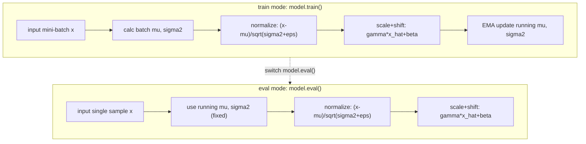

# Batch Normalization

## BN 的数学公式

Batch Normalization (BN) 由 Ioffe & Szegedy (2015) 提出，是深度学习最重要的训练技巧之一。

对每个 mini-batch $\mathcal{B} = \{x_1, \dots, x_m\}$ 和每个通道 $c$，BN 执行以下四步：

### 1. 计算批均值

$$\mu_{\mathcal{B}} = \frac{1}{m} \sum_{i=1}^{m} x_i$$

对 BatchNorm2d，$x_i$ 是通道 $c$ 在空间维度的所有像素值：
$$\mu_c = \frac{1}{N \times H \times W} \sum_{n=1}^{N} \sum_{h=1}^{H} \sum_{w=1}^{W} X[n, c, h, w]$$

### 2. 计算批方差

$$\sigma^2_{\mathcal{B}} = \frac{1}{m} \sum_{i=1}^{m} (x_i - \mu_{\mathcal{B}})^2$$

### 3. 标准化

$$\hat{x}_i = \frac{x_i - \mu_{\mathcal{B}}}{\sqrt{\sigma^2_{\mathcal{B}} + \epsilon}}$$

$\epsilon = 10^{-5}$ 是防止除零的小常数。

### 4. 缩放与平移（可学习参数）

$$y_i = \gamma \cdot \hat{x}_i + \beta$$

- $\gamma$ (gamma): 可学习的缩放参数（初始化为 1）
- $\beta$ (beta): 可学习的平移参数（初始化为 0）

**为什么需要 $\gamma$ 和 $\beta$？** 标准化到均值 0、方差 1 可能破坏网络的表达能力。例如 ReLU 之后的输出本应是正值，标准化会有一半变成负值被 ReLU 抑制。$\gamma$ 和 $\beta$ 让网络可以自己学出合适的均值和方差——如果"什么都不做"是最优的，$\gamma=1$, $\beta=0$ 即可恢复。

---

## 训练 vs 推理模式

### 训练模式 (`model.train()`)

使用当前 batch 的统计量 $\mu_{\mathcal{B}}$ 和 $\sigma^2_{\mathcal{B}}$。同时，用指数移动平均 (EMA) 维护全局运行统计量：

$$\mu_{\text{running}} = \alpha \cdot \mu_{\text{running}} + (1 - \alpha) \cdot \mu_{\mathcal{B}}$$

$$\sigma^2_{\text{running}} = \alpha \cdot \sigma^2_{\text{running}} + (1 - \alpha) \cdot \sigma^2_{\mathcal{B}}$$

其中 $\alpha$ 是 momentum（默认 0.1）。

### 推理模式 (`model.eval()`)

使用训练时累积的运行均值和方差（固定，不再更新）。这保证推理输出是确定性的——同一张图每次推理结果相同。

| | 训练模式 | 推理模式 |
|---|---|---|
| $\mu$ 来源 | 当前 batch | 累积运行均值 |
| $\sigma^2$ 来源 | 当前 batch | 累积运行方差 |
| 输出确定性 | 否（依赖 batch 构成） | 是 |
| Dropout | 启用 | 关闭 |



---

## 为什么 BN 有效

### 1. 缓解内部协变量偏移 (Internal Covariate Shift)

深度网络中，浅层参数的每次更新都会改变深层的输入分布。BN 将每层的输入强制标准化到稳定的分布，使得各层学习更加独立。

### 2. 平滑损失地形

BN 使损失曲面更加平滑——梯度更可预测，允许使用更大的学习率而不至于发散。

### 3. 正则化效应

由于每个样本的标准化依赖于 batch 内其他样本（训练时），BN 引入了一定程度的噪声，起到了轻微的正则化作用。这也是为什么使用 BN 后通常可以降低（甚至移除）Dropout。

### 4. 降低对初始化的敏感性

没有 BN 时，不当的初始化会导致信号快速衰减或放大。BN 强制每层输出服从稳定分布，大幅降低了初始化的难度。

---

## BN 的位置：Conv → BN → ReLU

本项目采用**预激活前的 BN**（BN 在 ReLU 之前）：

```
Conv2d → BatchNorm2d → ReLU → [MaxPool2d]
```

选择放在 ReLU 之前的理由：

- BN 将分布标准化为均值 0、对称分布 → ReLU 的阈值 0 能有效产生稀疏性（约 50% 神经元激活）
- 如果 BN 放在 ReLU 之后：ReLU 已将负值归零，BN 再标准化会产生负值——引入不必要的信号失真
- 实验证明 Conv → BN → ReLU 比 Conv → ReLU → BN 训练更稳定、收敛更快

---

## BatchNorm1d vs BatchNorm2d

| | BatchNorm1d | BatchNorm2d |
|---|---|---|
| 输入形状 | (N, C) | (N, C, H, W) |
| 归一化维度 | 沿 N 维对每个 C 独立归一化 | 沿 N×H×W 对每个 C 独立归一化 |
| 可学习参数 | $\gamma, \beta \in \mathbb{R}^C$ | $\gamma, \beta \in \mathbb{R}^C$ |
| 使用位置 | Linear 层之后 | Conv2d 层之后 |
| 项目中的使用 | `linear_block` (AlexNet, VGG FC) | `conv_block`, `vgg_conv`, GoogLeNet Stem/Inception |

---

## BN 在本项目中的使用

| 模型 | BN 使用 | 备注 |
|------|---------|------|
| LeNet-5 | 无 | 1998 年设计，早于 BN 时代 |
| AlexNet | FC 层有 BN1d | 原始论文无 BN，本实现添加 |
| VGG | Conv (BN2d) + FC (BN1d) | 原始论文无 BN，本实现添加 |
| NiN | 无 | mlpconv 设计，无 BN |
| GoogLeNet | Conv (BN2d)，FC 无 BN | 原始论文无 BN，本实现添加 |

---

## Layer Normalization

Layer Normalization (LN) 是 BN 的替代方案——沿特征维度归一化而非 batch 维度：

$$\mu_n = \frac{1}{C} \sum_{c=1}^{C} x_{n,c}$$

$$\sigma^2_n = \frac{1}{C} \sum_{c=1}^{C} (x_{n,c} - \mu_n)^2$$

$$y_{n,c} = \gamma_c \cdot \frac{x_{n,c} - \mu_n}{\sqrt{\sigma^2_n + \epsilon}} + \beta_c$$

**BN vs LN**:
- BN: 每个 channel 独立，依赖 batch 大小（batch 太小则统计量不稳定）
- LN: 每个样本独立，与 batch 大小无关
- LN 更常用于 RNN / Transformer（序列建模）；BN 更常用于 CNN（图像）

本项目不使用 LN——所有归一化均为 BN。

---

## 相关文档

- [Kaiming & Xavier 初始化](/math/initialization) — BN + 初始化协同工作
- [各层公式与设计原理](/math/layers) — Conv2d/ReLU/Linear 的详细公式
- [训练流程](/architecture/training) — `model.train()` vs `model.eval()` 的工程实现
