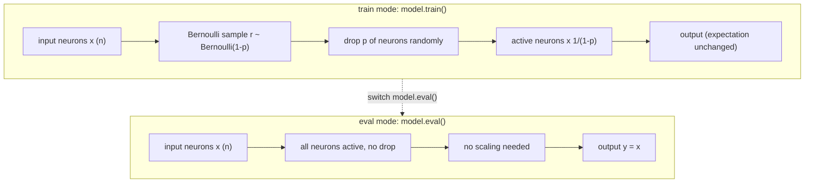

# Dropout

## 数学定义

Dropout 由 Srivastava et al. (2014) 提出，是最常用的神经网络正则化技术之一。

### 训练时

每个神经元以概率 $p$ 被随机"丢弃"（置零），存活的神经元被放大 $1/(1-p)$ 倍以保持期望不变：

$$y_j = \begin{cases} 0 & \text{以概率 } p \\ \frac{x_j}{1-p} & \text{以概率 } 1-p \end{cases}$$

等价地：

$$y = \frac{1}{1-p} \cdot r \odot x, \quad r_j \sim \text{Bernoulli}(1-p)$$

其中 $r_j$ 是独立的伯努利随机变量（0 或 1），$\odot$ 表示逐元素乘法。

### 推理时

Dropout **关闭**——所有神经元正常工作，无需缩放：

$$y = x$$

因为在训练时已经通过 $1/(1-p)$ 缩放了存活神经元的输出，推理时无需额外调整。

---

## 为什么需要 $1/(1-p)$ 缩放

缩放保证了训练和推理时期望的一致性：

$$\mathbb{E}[y_j] = \mathbb{E}\left[\frac{r_j \cdot x_j}{1-p}\right] = \frac{(1-p) \cdot x_j}{1-p} = x_j$$

如果不在训练时缩放，推理时需要对所有权重乘以 $(1-p)$——这在实践上麻烦且在微调/迁移学习时容易出错。

---

## 集成解释 (Ensemble View)

有 $n$ 个神经元的层在训练时会产生 $2^n$ 种不同的子网络（每个神经元独立地"存在"或"不存在"）。每个 batch 训练一个随机采样的子网络，Dropout 等价于**隐式地训练 $2^n$ 个网络的集成**。推理时所有子网络同时工作（没有丢弃任何神经元），输出近似于所有子网络预测的几何平均。

这也是为什么 Dropout 通常在 FC 层使用而卷积层不使用的原因之一——Conv 层神经元数量巨大，$2^n$ 集成已经足够强。

---

## Dropout 概率的选择

| $p$ 值 | 效果 | 适用场景 |
|--------|------|---------|
| 0.5 | 最大正则化 | FC 层（AlexNet、VGG 标准做法） |
| 0.4 | 较强正则化 | GoogLeNet 分类头 |
| 0.2-0.3 | 轻微正则化 | 卷积层（不推荐，项目未使用） |
| 0.0 | 不使用 | 训练数据量大或已有 BN 足够时 |

---

## 为什么卷积层通常不用 Dropout

1. **参数共享减少了过拟合**: 卷积核在全图滑动，参数量远小于 FC 层，天然不容易过拟合
2. **BN 提供正则化**: BatchNorm 已有轻微的正则化效果
3. **空间相关性**: 相邻像素高度相关，随机丢弃单个像素的效果被邻近像素补偿
4. **Spatial Dropout**: 如果需要 Conv 层的正则化，通常使用 Dropout2D——丢弃整个通道而非单个像素

---

## 本项目的 Dropout 使用

| 模型 | Dropout 概率 | 位置 | 备注 |
|------|:-----------:|------|------|
| LeNet-5 | — | — | 1998 年设计，早于 Dropout |
| AlexNet | 0.5 | FC1, FC2 | 原始论文标准值 |
| VGG11-19 | 0.5 | FC1, FC2 | 原始论文标准值 |
| NiN | — | — | GAP 自带足够正则化 |
| GoogLeNet | 0.4 | 分类头 (GAP 后) | 原始论文标准值 |

### 代码位置

- AlexNet: [cnnlib/models/alexnet.py](https://github.com/NayukiChiba/ALL-CNN/blob/main/cnnlib/models/alexnet.py) — `linear_block(..., dropout=0.5)`
- VGG: [cnnlib/models/vgg.py](https://github.com/NayukiChiba/ALL-CNN/blob/main/cnnlib/models/vgg.py) — `linear_block(..., dropout=0.5)`
- GoogLeNet: [cnnlib/models/googlenet.py](https://github.com/NayukiChiba/ALL-CNN/blob/main/cnnlib/models/googlenet.py) — `nn.Dropout(p=0.4)` 在 head 中
- `linear_block` 实现: [cnnlib/models/blocks.py:56-81](https://github.com/NayukiChiba/ALL-CNN/blob/main/cnnlib/models/blocks.py#L56-L81)

---

## Dropout2D（空间 Dropout）

`nn.Dropout2d(p)` 在通道维度上做 Dropout——丢弃整个通道，而非单像素：

$$y_{c,i,j} = \begin{cases} 0 & \text{以概率 } p \\ \frac{x_{c,i,j}}{1-p} & \text{以概率 } 1-p \end{cases}$$

（$r_c$ 对同一通道的所有像素位置相同）

本项目未使用 Dropout2D——卷积层依赖 BN 和数据增强提供正则化。

---

## Dropout 与 BN 的互动

BN 之后加 Dropout 可能导致训练和推理时的输出分布不一致（"variance shift"）。在实践中：
- BN 在前，Dropout 在后（本项目做法）——BN 稳定分布后 Dropout 做正则化
- 如果发现训练误差远低于验证误差，考虑降低 Dropout 概率或添加更多数据增强

---

## 相关文档

- [Batch Normalization](/math/batch-normalization) — BN 与 Dropout 的正则化互补
- [L1/L2/Weight Decay](/math/regularization) — 其他正则化技术
- [AlexNet](/models/alexnet) — 首次大规模使用 Dropout 的 CNN
