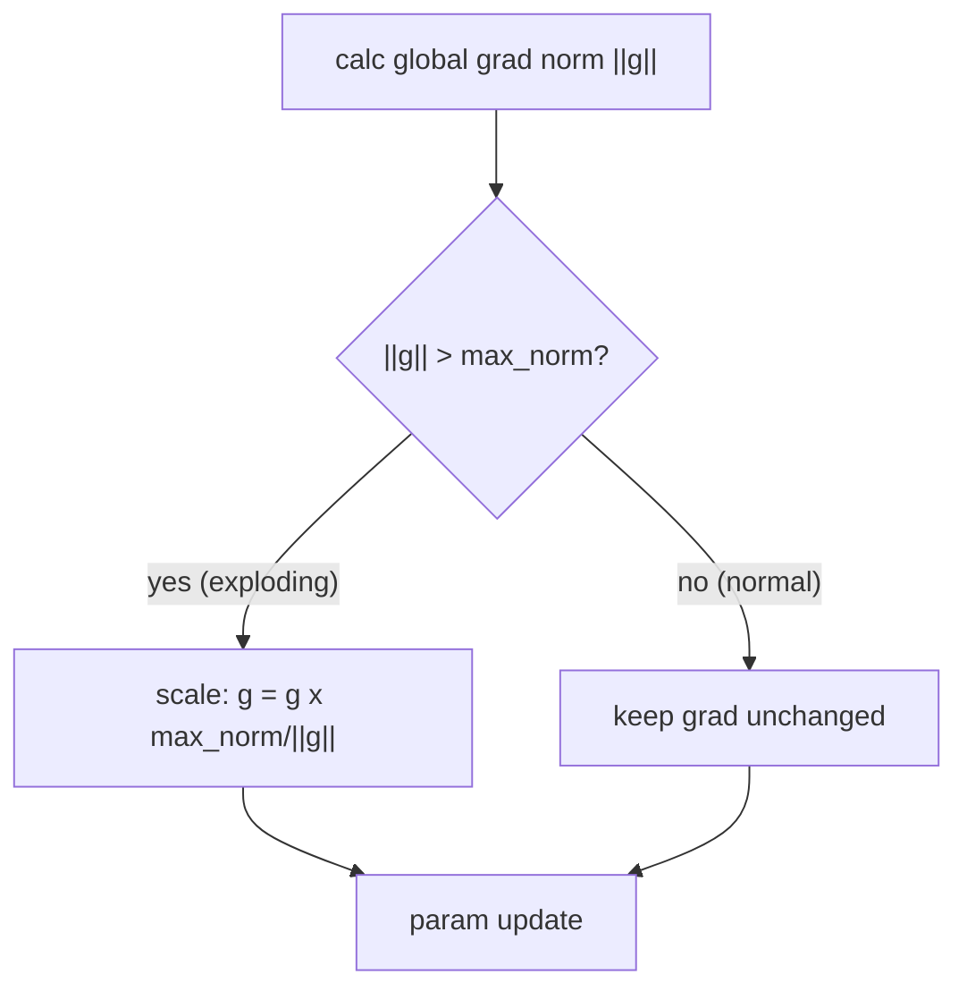

# 梯度裁剪

## 为什么需要梯度裁剪

在深度网络训练中，偶尔会出现**梯度爆炸**——反向传播时梯度逐层放大，最终梯度范数异常巨大。这会导致：
- 参数更新步长过大，模型跳到一个很差的参数空间
- loss 突然变为 NaN，训练崩溃

梯度裁剪是防止梯度爆炸的最后防线——在参数更新前将梯度限制在合理范围内。

---

## Gradient Norm Clipping

### 公式

设所有参数的梯度向量为 $\mathbf{g}$（将所有参数的梯度拼接成一个长向量）。如果 $\|\mathbf{g}\| > \text{max\_norm}$，则将梯度缩放到范数为 $\text{max\_norm}$：

$$\mathbf{g}_{\text{clipped}} = \begin{cases} \mathbf{g} & \text{if } \|\mathbf{g}\| \leq \text{max\_norm} \\ \mathbf{g} \cdot \frac{\text{max\_norm}}{\|\mathbf{g}\|} & \text{if } \|\mathbf{g}\| > \text{max\_norm} \end{cases}$$

等价形式：

$$\mathbf{g}_{\text{clipped}} = \mathbf{g} \cdot \min\left(1, \frac{\text{max\_norm}}{\|\mathbf{g}\|}\right)$$

$\|\mathbf{g}\|$ 是所有参数梯度的 L2 范数（全局范数）：

$$\|\mathbf{g}\| = \sqrt{\sum_{p \in \theta} \|\nabla_p \mathcal{L}\|_2^2}$$

### PyTorch 实现

```python
nn.utils.clip_grad_norm_(model.parameters(), max_norm)
```

- `model.parameters()`: 模型所有可训练参数
- `max_norm`: 梯度范数的上限阈值
- 操作是**原地 (inplace)**的——直接修改 `.grad` 属性

### 在本项目中的使用

**源码**: [cnnlib/training/engine.py](https://github.com/NayukiChiba/ALL-CNN/blob/main/cnnlib/training/engine.py) — `trainOneEpoch()`

```python
if grad_clip > 0:
    nn.utils.clip_grad_norm_(model.parameters(), grad_clip)
```

默认 `grad_clip=0`（禁用）。通过 CLI 启用: `python main.py train --grad-clip 1.0`

---

## Gradient Value Clipping

除了按范数裁剪，PyTorch 还提供按值裁剪：

```python
nn.utils.clip_grad_value_(model.parameters(), clip_value)
```

将每个参数的梯度值限制在 `[-clip_value, clip_value]` 范围内：

$$g_i = \text{clamp}(g_i, -\text{clip\_value}, +\text{clip\_value})$$

这种方式更简单粗暴，不保持梯度方向。实践中 Norm Clipping 更常用。

---

## 梯度裁剪示意



---

## 何时使用

| 情况 | 建议 |
|------|------|
| 训练稳定，loss 正常下降 | 不需要（禁用） |
| VGG/GoogLeNet 等深层网络 | 建议 `max_norm=1.0` |
| 出现过 loss NaN | 立即启用 `max_norm=0.5~1.0` |
| 使用 SGD 优化器 | 建议启用（SGD 无自适应学习率保护） |
| 使用 Adam/AdamW | 通常不需要（自适应学习率提供保护） |

---

## 与其他技术的关系

| 技术 | 解决什么问题 | 关系 |
|------|------------|------|
| Kaiming/Xavier 初始化 | 防止信号传播中的方差偏移 | 从源头减少梯度爆炸的可能 |
| Batch Normalization | 稳定各层的输入分布 | 减少层间梯度传播的放大 |
| 梯度裁剪 | 梯度已经爆炸时紧急刹车 | 最后防线 |
| 学习率调度 | 训练后期缩小步长 | 与梯度裁剪协同 |

---

## 相关文档

- [Kaiming & Xavier 初始化](/math/initialization) — 预防梯度爆炸的初始化策略
- [Batch Normalization](/math/batch-normalization) — BN 稳定梯度传播
- [训练流程](/architecture/training) — Trainer 中的 grad_clip 参数
