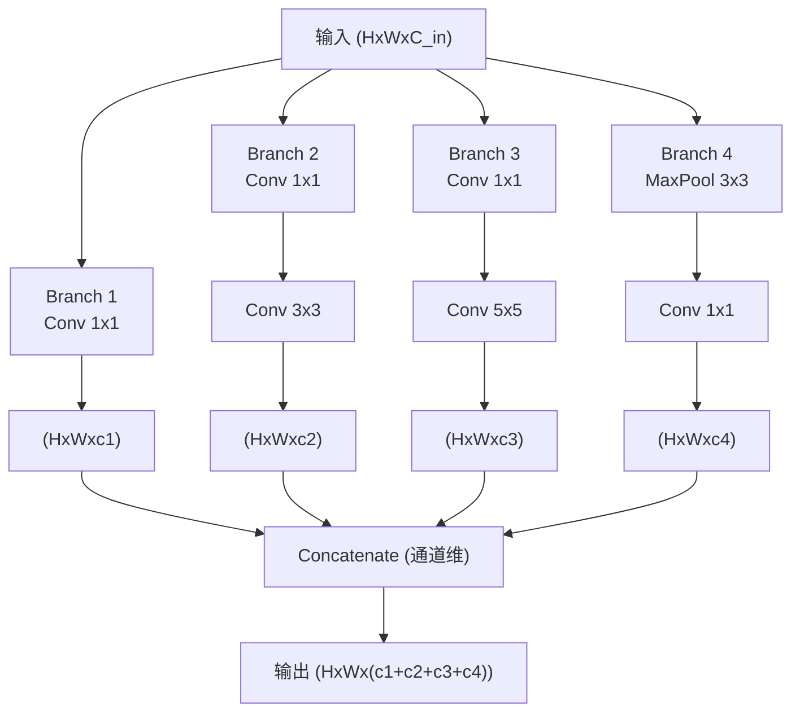
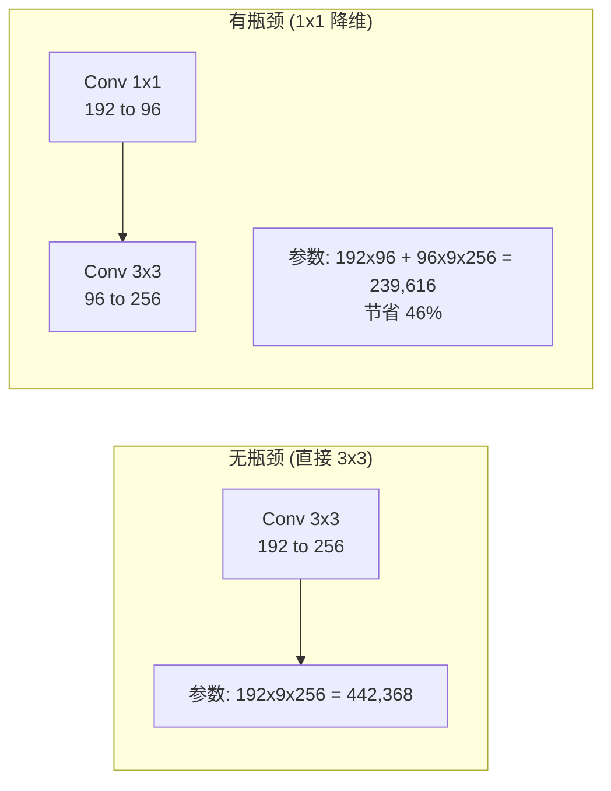

# GoogLeNet / Inception v1 (2015)

## 论文来源

Szegedy, C., Liu, W., Jia, Y., et al. (2015). *Going Deeper with Convolutions*. CVPR.

**历史地位**: 2014 年 ImageNet 冠军（top-5 错误率 6.7%）。引入 **Inception 模块**——在同一层内并行使用多种尺寸的卷积核，让网络自动学习最优尺度组合。同时用 1×1 瓶颈大幅压缩参数量，22 层深度仅 6.8M 参数。

名称来源于电影《盗梦空间》(Inception) 和 Linn 等人的 Network in Network（此 GoogLeNet 致敬 LeNet）。

---

## 架构图

```
输入 X₀ : (B, 3, 224, 224)
  │
  ├─ Stem（预处理阶段）
  │    Conv(7×7, s=2, p=3, 3→64) + BN + ReLU    → (B, 64, 112, 112)
  │    MaxPool(3×3, s=2, p=1)                    → (B, 64, 56, 56)
  │    Conv(1×1, 64→64) + BN + ReLU              → (B, 64, 56, 56)
  │    Conv(3×3, p=1, 64→192) + BN + ReLU        → (B, 192, 56, 56)
  │    MaxPool(3×3, s=2, p=1)                    → (B, 192, 28, 28)
  │
  ├─ Inception 3a (192→256, 28×28)
  ├─ Inception 3b (256→480, 28×28)
  ├─ MaxPool(3×3, s=2, p=1)                      → (B, 480, 14, 14)
  │
  ├─ Inception 4a (480→512, 14×14)
  ├─ Inception 4b (512→512, 14×14)
  ├─ Inception 4c (512→512, 14×14)
  ├─ Inception 4d (512→528, 14×14)
  ├─ Inception 4e (528→832, 14×14)
  ├─ MaxPool(3×3, s=2, p=1)                      → (B, 832, 7, 7)
  │
  ├─ Inception 5a (832→832, 7×7)
  ├─ Inception 5b (832→1024, 7×7)               → (B, 1024, 7, 7)
  │
  └─ Head
       AdaptiveAvgPool2d(1)                       → (B, 1024, 1, 1)
       Dropout(0.4)
       Flatten                                    → (B, 1024)
       Linear(1024→num_classes)                   → (B, num_classes)
```


---

## 核心创新：Inception 模块

Inception 模块的核心思想：**在同一层内用多种卷积核尺寸并行提取特征，然后在通道维拼接**。网络自己通过反向传播学会每个位置哪种尺度最重要。

### 四条分支

```
输入 (H×W×C_in)
  │
  ├─ Branch 1: Conv 1×1                     ──→ (H×W×c1)
  │
  ├─ Branch 2: Conv 1×1 → Conv 3×3          ──→ (H×W×c2)
  │
  ├─ Branch 3: Conv 1×1 → Conv 5×5          ──→ (H×W×c3)
  │
  └─ Branch 4: MaxPool 3×3 → Conv 1×1       ──→ (H×W×c4)
                                                  │
                                    Concatenate ←─┘
                                                  ↓
                                            (H×W×(c1+c2+c3+c4))
```



### 为什么需要多尺度？

不同尺寸的卷积核适合捕捉不同范围的特征：
- **1×1**: 逐像素的通道间组合，适合检测颜色一致性或简单的通道关系
- **3×3**: 中等感受野，适合检测纹理、角点、局部形状
- **5×5**: 较大感受野，适合检测物体部件、全局纹理
- **MaxPool + 1×1**: 池化提供另一种特征提取方式（取邻域最优），是对卷积分支的补充

### 1×1 瓶颈：计算量控制的秘诀

直接堆叠大卷积核会使参数爆炸。Inception 使用 1×1 卷积作为**瓶颈层**先降低通道数：

```
无瓶颈:  Conv 3×3:  C_in × 9 × C_out
有瓶颈:  Conv 1×1:  C_in × C_reduce + C_reduce × 9 × C_out
```

**实例**: 假设 $C_{in}=192$, $C_{out}=128$

| 方式 | 计算 |
|------|------|
| 直接 3×3 | $192 \times 9 \times 128 = 221,184$ |
| 1×1(192→96) → 3×3(96→128) | $192 \times 96 + 96 \times 9 \times 128 = 129,024$ |

**节省 42% 参数！** 而且多了一层非线性。



---

## Inception 参数表

每个 Inception 模块有 6 个参数 `(c1, c2_reduce, c2, c3_reduce, c3, c4)`，定义在 [INCEPTION_PARAMS](https://github.com/NayukiChiba/ALL-CNN/blob/main/cnnlib/models/googlenet.py#L31-L41)：

| 模块 | 输入通道 | c1 | c2_reduce | c2 | c3_reduce | c3 | c4 | 输出通道 |
|------|---------|----|-----------|-----|-----------|-----|-----|---------|
| 3a | 192 | 64 | 96 | 128 | 16 | 32 | 32 | 256 |
| 3b | 256 | 128 | 128 | 192 | 32 | 96 | 64 | 480 |
| 4a | 480 | 192 | 96 | 208 | 16 | 48 | 64 | 512 |
| 4b | 512 | 160 | 112 | 224 | 24 | 64 | 64 | 512 |
| 4c | 512 | 128 | 128 | 256 | 24 | 64 | 64 | 512 |
| 4d | 512 | 112 | 144 | 288 | 32 | 64 | 64 | 528 |
| 4e | 528 | 256 | 160 | 320 | 32 | 128 | 128 | 832 |
| 5a | 832 | 256 | 160 | 320 | 32 | 128 | 128 | 832 |
| 5b | 832 | 384 | 192 | 384 | 48 | 128 | 128 | 1024 |

输出通道 = c1 + c2 + c3 + c4。例如 3a: 64 + 128 + 32 + 32 = 256。

---

## 参数量估算

| 组件 | 参数量 |
|------|--------|
| Stem (7×7 + 1×1 + 3×3) | ~100K |
| Inception 3a-3b | ~1.5M |
| Inception 4a-4e | ~3.5M |
| Inception 5a-5b | ~1.8M |
| Head (GAP + Dropout + FC) | ~1M |
| **总计** (ImageNet 1000 类) | **~6.8M** |
| (CIFAR-10, 10 类) | **~5.8M** |

> 6.8M 参数——22 层深度！对比 VGG16 的 138M（16 层）和 AlexNet 的 57M（8 层），GoogLeNet 实现了更深但参数更少的效果。

<div style="max-width:520px;margin:1em auto;font-size:13px;line-height:1.8;">
  <div style="text-align:center;font-weight:600;margin-bottom:8px;">GoogLeNet vs VGG16 参数量与深度对比</div>
  <div style="margin-bottom:8px;font-weight:500;">参数量 (M)</div>
  <div style="display:flex;align-items:center;">
    <span style="width:110px;text-align:right;margin-right:8px;flex-shrink:0;">GoogLeNet</span>
    <span style="height:14px;background:#3498db;width:4.53%;display:inline-block;border-radius:2px;min-width:2px;"></span>
    <span style="margin-left:6px;flex-shrink:0;">6.8M</span>
  </div>
  <div style="display:flex;align-items:center;">
    <span style="width:110px;text-align:right;margin-right:8px;flex-shrink:0;">VGG16</span>
    <span style="height:14px;background:#3498db;width:92%;display:inline-block;border-radius:2px;min-width:2px;"></span>
    <span style="margin-left:6px;flex-shrink:0;">138M</span>
  </div>
  <div style="margin-top:12px;margin-bottom:8px;font-weight:500;">深度 (层)</div>
  <div style="display:flex;align-items:center;">
    <span style="width:110px;text-align:right;margin-right:8px;flex-shrink:0;">GoogLeNet</span>
    <span style="height:14px;background:#3498db;width:88%;display:inline-block;border-radius:2px;min-width:2px;"></span>
    <span style="margin-left:6px;flex-shrink:0;">22 层</span>
  </div>
  <div style="display:flex;align-items:center;">
    <span style="width:110px;text-align:right;margin-right:8px;flex-shrink:0;">VGG16</span>
    <span style="height:14px;background:#3498db;width:64%;display:inline-block;border-radius:2px;min-width:2px;"></span>
    <span style="margin-left:6px;flex-shrink:0;">16 层</span>
  </div>
</div>

---

## 关键设计决策

### 1. Stem 阶段

在进入 Inception 模块前，先用传统的 Conv + MaxPool 序列将空间尺寸从 224×224 降至 28×28。这减少了后续 Inception 模块的计算量（Inception 主要在高分辨率层计算昂贵）。

### 2. 空间缩减时机

GoogLeNet 在三个位置做 MaxPool（stride=2），形成三个分辨率区域：

| 区域 | 空间尺寸 | Inception 模块 |
|------|---------|---------------|
| 低层 | 28×28 | 3a, 3b |
| 中层 | 14×14 | 4a-4e |
| 高层 | 7×7 | 5a, 5b |

这种设计确保低层（28×28）有较少模块（2 个），而中层（14×14）有最多模块（5 个）——因为中层是特征最丰富、尺度最适中的区域。

### 3. 无辅助分类器

原始论文在 4a 和 4d 后添加了辅助分类器以提供额外的梯度信号。本项目未实现它们——因为：
- BatchNorm 的加入已经解决了梯度传播问题
- 辅助分类器在现代训练中很少使用
- 简化代码结构

### 4. BN 的添加

原始 GoogLeNet 没有使用 BatchNorm（BN 在 2015 年同期才被提出）。本项目在所有卷积后添加 BN，使训练更稳定。

### 5. GAP 继承自 NiN

GoogLeNet 继承并改进了 NiN 的全局平均池化思想：NiN 用 GAP 完全消除 FC，GoogLeNet 用 GAP + Dropout + 单层轻量 FC（1024→num_classes），在 NiN 的极端设计和传统 FC 之间取得了平衡。

---

## 权重初始化

```python
def _initWeights(self):
    for m in self.modules():
        if isinstance(m, nn.Conv2d):
            nn.init.kaiming_normal_(m.weight, mode="fan_out", nonlinearity="relu")
        elif isinstance(m, nn.BatchNorm2d):
            nn.init.constant_(m.weight, 1)
            nn.init.constant_(m.bias, 0)
        elif isinstance(m, nn.Linear):
            nn.init.normal_(m.weight, mean=0, std=0.01)
```

- Conv: Kaiming 初始化（匹配 ReLU）
- BatchNorm: gamma=1, beta=0
- Linear: 正态 N(0, 0.01)，匹配原始论文

---

## forward() 方法

```python
def forward(self, x):
    x = self.stem(x)        # Stem 预处理
    x = self.inception3(x)  # 3a → 3b → MaxPool
    x = self.inception4(x)  # 4a → 4b → 4c → 4d → 4e → MaxPool
    x = self.inception5(x)  # 5a → 5b
    x = self.head(x)        # GAP → Dropout → Flatten → Linear
    return x
```

**源码**: [cnnlib/models/googlenet.py:135-141](https://github.com/NayukiChiba/ALL-CNN/blob/main/cnnlib/models/googlenet.py#L135-L141)

---

## 感受野

由于 Inception 模块内含多尺度卷积（1×1、3×3、5×5），不同分支在同一层的感受野不同。Inception 的核心优势正是让网络可以同时利用多种感受野的信息。

最大感受野路径（通过 5×5 分支）：
- 3a 的 5×5 分支在 28×28 层的感受野约相当于原始图像的 15×15
- 5b 的 5×5 分支在 7×7 层的感受野几乎覆盖全图 224×224


---

## GoogLeNet 的思想遗产

- **Inception v2/v3**: 将 5×5 卷积拆分为两个 3×3（类似 VGG 思想），引入批归一化
- **Inception v4 / Inception-ResNet**: 结合残差连接
- **Xception**: 将 Inception 推向极致——完全用深度可分离卷积替代 Inception 模块
- **1×1 瓶颈**: 成为现代高效架构的标准技术（MobileNet、EfficientNet 等）

---

## 训练建议

- **推荐数据集**: CIFAR-100, Caltech-101, Flowers-102, STL-10
- **输入尺寸**: 224×224（Transform 自动 Resize）
- **参数量适中**: ~6.8M，GPU 推荐但大 batch CPU 也可训练
- **效率优势**: 参数量远小于 VGG，训练速度约为 VGG16 的 3-5 倍
- **Dropout 可调**: 默认 0.4，大数据集可降低到 0.2

---

## 相关文档

- [NiN](/models/nin) — 1×1 卷积和 GAP 的先驱
- [VGG](/models/vgg) — 同年的另一种深度哲学
- [Inception 模块源码](https://github.com/NayukiChiba/ALL-CNN/blob/main/cnnlib/models/blocks.py#L87-L157)
- [Kaiming 初始化](/math/initialization)
- [参数量计算](/math/parameter-count)
