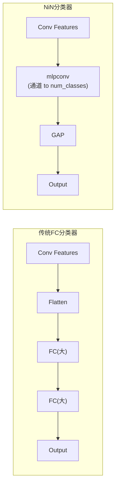

# NiN — Network in Network (2014)

## 论文来源

Lin, M., Chen, Q., & Yan, S. (2014). *Network In Network*. ICLR.

**历史地位**: 提出了两大思想——**mlpconv**（用微 MLP 替代单层卷积）和**全局平均池化**（替代全连接分类器）。这两大思想深刻影响了后续所有 CNN 架构（GoogLeNet、ResNet、DenseNet 等）。

---

## 架构图

```
输入 X₀ : (B, 3, 32, 32)
  │
  ├─ Stage 1: nin_block(3→192, k=5)
  │     Conv 5×5(3→192) → ReLU → Conv 1×1(192→192) → ReLU → Conv 1×1(192→192) → ReLU
  │     输出: (B, 192, 32, 32)
  ├─ MaxPool(3×3, stride=2, pad=1)  →  (B, 192, 15, 15)
  │
  ├─ Stage 2: nin_block(192→160, k=5)
  │     Conv 5×5(192→160) → ReLU → Conv 1×1(160→160) → ReLU → Conv 1×1(160→160) → ReLU
  │     输出: (B, 160, 15, 15)
  ├─ MaxPool(3×3, stride=2, pad=1)  →  (B, 160, 6, 6)
  │
  ├─ Stage 3: nin_block(160→96, k=3)
  │     Conv 3×3(160→96) → ReLU → Conv 1×1(96→96) → ReLU → Conv 1×1(96→96) → ReLU
  │     输出: (B, 96, 6, 6)
  ├─ MaxPool(3×3, stride=2, pad=1)  →  (B, 96, 2, 2)
  │
  ├─ Classifier: nin_block(96→num_classes, k=3)
  │     输出: (B, num_classes, 2, 2)
  │
  ├─ AdaptiveAvgPool2d(1)            →  (B, num_classes, 1, 1)
  └─ Flatten                         →  (B, num_classes)
```


---

## 核心创新 1：mlpconv（微 MLP 卷积）

### 问题

传统卷积层只做一次线性变换 + 非线性激活：

$$y = \text{ReLU}(W * x + b)$$

这假设特征是线性可分的——但实际上局部感受野内的模式可能需要更复杂的决策边界。

### 解决方案

用一个小型多层感知机（MLP）替代单次卷积：

```
传统 Conv:   输入 ─→ Conv ─→ ReLU ─→ 输出
mlpconv:     输入 ─→ Conv(k×k) ─→ ReLU ─→ Conv(1×1) ─→ ReLU ─→ Conv(1×1) ─→ ReLU ─→ 输出
```

$$\begin{aligned}
h_1 &= \text{ReLU}(W_1 * x + b_1) \quad \text{（标准卷积，提取空间特征）} \\
h_2 &= \text{ReLU}(W_2 * h_1 + b_2) \quad \text{（1×1 卷积 = 逐像素全连接）} \\
y &= \text{ReLU}(W_3 * h_2 + b_3) \quad \text{（1×1 卷积 = 再次非线性组合）}
\end{aligned}$$

mlpconv 等价于在每个像素位置放一个三层的 MLP。这个 MLP 在整张图上滑动（参数共享），因此称为"网络中的网络 (Network in Network)"。


### 1×1 卷积的本质

1×1 卷积（[nin_block 中的第二、三层](https://github.com/NayukiChiba/ALL-CNN/blob/main/cnnlib/models/blocks.py#L163-L196)）不改变空间尺寸，只做通道间的全连接变换：

$$y[c_{out}, i, j] = b[c_{out}] + \sum_{c_{in}=0}^{C_{in}-1} W[c_{out}, c_{in}] \cdot x[c_{in}, i, j]$$

这等价于在每个像素 $(i,j)$ 位置独立地做一次矩阵乘法 $y = Wx + b$。它：
- 增加非线性表达能力（每个像素有 3 层非线性）
- 混合跨通道信息
- 参数量极少（1×1×C_in×C_out vs k×k×C_in×C_out）

---

## 核心创新 2：全局平均池化（Global Average Pooling）

### 传统做法的缺陷

传统 CNN（LeNet/AlexNet/VGG）在卷积特征提取后使用：
```
Flatten → FC(大) → FC(大) → FC(num_classes)
```

问题：
- **参数量爆炸**: VGG FC 层高达 123M 参数
- **过拟合**: 大量参数在小数据集上极容易过拟合
- **黑箱**: FC 层缺乏空间对应关系——不知道哪个位置的特征贡献了分类结果

### NiN 的解决方案

用**与类别数相同通道数的卷积** + **全局平均池化**完全替代 FC 层：

```
最后层: nin_block(96→num_classes, k=3)
        ↓ (B, num_classes, 2, 2)
AdaptiveAvgPool2d(1)
        ↓ (B, num_classes, 1, 1)
Flatten
        ↓ (B, num_classes)
```

数学上：

$$\text{score}_c = \frac{1}{H \times W} \sum_{i=1}^{H} \sum_{j=1}^{W} F_c[i, j]$$

每个类别的得分 = 该类特征图的空间平均值。


### 优势

| | FC 分类器 | GAP 分类器 |
|---|---|---|
| 参数量 | O(H×W×C×num_classes) | 0 |
| 过拟合风险 | 高 | 低（自带强正则化） |
| 空间解释性 | 无 | 每个通道对应一个类别的置信度图 |
| 输入尺寸要求 | 固定 | 灵活（AdaptiveAvgPool 自动处理） |



---

## 参数量计算

| 层 | 参数 | 累计 |
|----|------|------|
| Stage1 nin_block (3→192) | 3×5×5×192 + 192 + 192×1×1×192 + 192 + 192×1×1×192 + 192 | ~92K |
| Stage2 nin_block (192→160) | 192×5×5×160 + 160 + 160×160 + 160 + 160×160 + 160 | ~820K |
| Stage3 nin_block (160→96) | 160×3×3×96 + 96 + 96×96 + 96 + 96×96 + 96 | ~157K |
| Classifier nin_block (96→10) | 96×3×3×10 + 10 + 10×10 + 10 + 10×10 + 10 | ~9K |
| **总计** (CIFAR-10, 10 类) | | **~1.08M** |

> 约 1M 参数——比 AlexNet (57M) 少 50 倍，比 VGG16 (138M) 少 130 倍！而且分类器参数量几乎为 0。

---

## 尺寸变化

NiN 使用带 padding 的 MaxPool（3×3, stride=2, padding=1），使得每次池化后尺寸为：

$$H' = \left\lfloor \frac{H + 2 \times 1 - 3}{2} \right\rfloor + 1$$

即 32 → 15 → 6 → 2（非整数向下取整）。最终的 2×2 特征图经过 AdaptiveAvgPool2d(1) 得到每个类别的单一得分。

---

## 权重初始化

```python
def _initWeights(self):
    for m in self.modules():
        if isinstance(m, nn.Conv2d):
            nn.init.kaiming_normal_(m.weight, mode="fan_out", nonlinearity="relu")
```

全部使用 Kaiming 初始化——与 mlpconv 中大量使用的 ReLU 激活匹配。

---

## NiN 的思想遗产

NiN 的两大创新深刻影响了后续所有 CNN 架构：

### 1. 1×1 卷积
- **GoogLeNet**: Inception 模块中的 1×1 瓶颈降维
- **ResNet**: bottleneck 残差块中的 1×1 卷积
- **DenseNet**: 过渡层中的 1×1 卷积压缩

### 2. 全局平均池化
- **GoogLeNet**: AdaptiveAvgPool2d(1) → Dropout → FC（仅一层轻量 FC）
- **ResNet**: AdaptiveAvgPool2d(1) → FC(num_classes)（FC 仅一层）
- **DenseNet**: 同 ResNet
- **几乎所有现代 CNN**: FC 分类器被 GAP + 单层 FC 取代

---

## forward() 方法

```python
def forward(self, x):
    x = self.stage1(x)      # nin_block → MaxPool
    x = self.stage2(x)      # nin_block → MaxPool
    x = self.stage3(x)      # nin_block → MaxPool
    x = self.classifier(x)  # nin_block → AdaptiveAvgPool2d → (B, C, 1, 1)
    x = torch.flatten(x, 1) # (B, num_classes, 1, 1) → (B, num_classes)
    return x
```

**源码**: [cnnlib/models/nin.py:76-82](https://github.com/NayukiChiba/ALL-CNN/blob/main/cnnlib/models/nin.py#L76-L82)

---

## 训练建议

- **推荐数据集**: CIFAR-10, CIFAR-100, SVHN（32×32 RGB）
- **输入尺寸固定**: 32×32（设计限制，无法更改）
- **训练速度**: 参数量小，CPU 上也可高效训练
- **典型表现**: CIFAR-10 上 ~85-90% 准确率
- **优势**: 不易过拟合（GAP 自带强正则化），适合小数据集

---

## 相关文档

- [GoogLeNet](/models/googlenet) — Inception 模块继承 NiN 的 1×1 卷积和 GAP
- [各层公式与设计原理](/math/layers) — Conv2d/ReLU/MaxPool 公式
- [Kaiming 初始化](/math/initialization) — Kaiming normal 推导
- [参数量计算](/math/parameter-count) — 1×1 卷积参数量极小的原因
