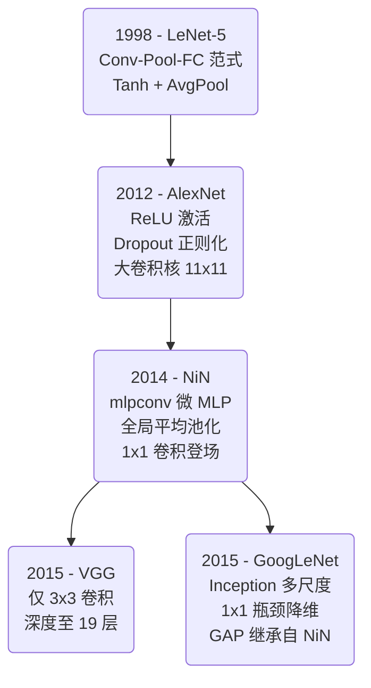
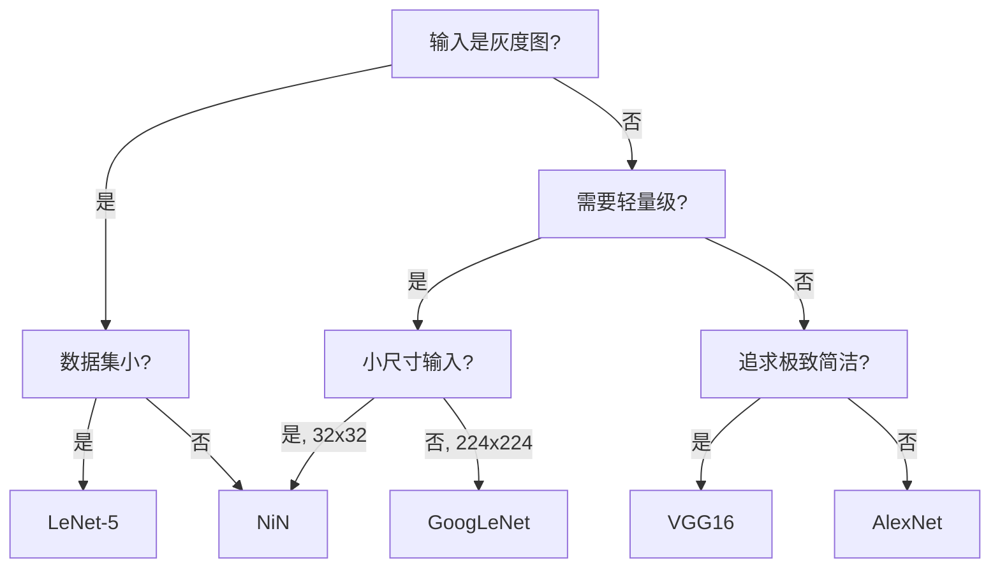

# 模型族系总览

## 8 种经典架构一览

| 架构 | 年份 | 论文 | 核心创新 | 输入 | 通道 | 参数规模 |
|------|------|------|---------|------|------|---------|
| LeNet-5 | 1998 | LeCun et al. | CNN 开山之作，卷积+池化+全连接范式 | 32×32 | 1 | ~62K |
| AlexNet | 2012 | Krizhevsky et al. | ReLU + Dropout + 深度突破，首个 ImageNet 冠军 CNN | 224×224 | 3 | ~57M |
| VGG11 | 2015 | Simonyan & Zisserman | 仅 3×3 卷积的统一设计，深度至 11 层 | 224×224 | 3 | ~133M |
| VGG13 | 2015 | 同上 | 加深至 13 层 | 224×224 | 3 | ~133M |
| VGG16 | 2015 | 同上 | 加深至 16 层（最常用） | 224×224 | 3 | ~138M |
| VGG19 | 2015 | 同上 | 加深至 19 层 | 224×224 | 3 | ~144M |
| NiN | 2014 | Lin et al. | mlpconv + 全局平均池化替代 FC | 32×32 | 3 | ~1M |
| GoogLeNet | 2015 | Szegedy et al. | Inception 多尺度 + 1×1 瓶颈 + GAP | 224×224 | 3 | ~6.8M |

---

## 创新演进时间线

```
1998 ─ LeNet-5
       │  CNN 范式确立: Conv→Pool→FC
       │  Tanh + AvgPool + Xavier 初始化
       │
2012 ─ AlexNet
       │  引入 ReLU（解决梯度消失）
       │  引入 Dropout（正则化大规模 FC 层）
       │  11×11/5×5 大卷积核
       │  双 GPU 并行（原论文）
       │
2014 ─ NiN (Network in Network)
       │  引入 mlpconv（微 MLP 替代单次卷积）
       │  引入全局平均池化（消除 FC 层）
       │  1×1 卷积首次被用作特征变换
       │
2015 ─ VGG (11/13/16/19)
       │  引入"仅 3×3"哲学
       │  深度至上（11→19 层）
       │  统一架构设计（无大卷积核混合）
       │
2015 ─ GoogLeNet (Inception v1)
          引入多尺度并行分支
          引入 1×1 瓶颈降维
          22 层深度，但仅 6.8M 参数
          全局平均池化继承自 NiN
```



---

## 技术特性对比

| 特性 | LeNet-5 | AlexNet | VGG | NiN | GoogLeNet |
|------|:------:|:------:|:---:|:---:|:---------:|
| 激活函数 | Tanh | ReLU | ReLU | ReLU | ReLU |
| 池化方式 | AvgPool | MaxPool | MaxPool | MaxPool | MaxPool |
| 分类器 | FC×2 | FC×2 + Dropout | FC×2 + Dropout | GAP（无 FC） | GAP + Dropout + FC |
| 归一化 | 无 | 无 | BN（本项目添加） | 无 | BN（本项目添加） |
| Dropout | 无 | 0.5 (FC) | 0.5 (FC) | 无 | 0.4 (head) |
| 卷积核 | 5×5 | 11/5/3 | 3×3 only | 5/3 + 1×1 | 1/3/5 + 1×1 |
| 权重初始化 | Xavier uniform | Conv: Kaiming, Linear: Xavier | Conv: Kaiming, BN: 1/0, Linear: N(0,0.01) | Kaiming | Conv: Kaiming, BN: 1/0, Linear: N(0,0.01) |
| 可学习参数 | ~62K | ~57M | ~133-144M | ~1M | ~6.8M |

---

## 参数量对比（粗略）

| 模型 | Conv 参数 | FC 参数 | 总参数 | FC 占比 |
|------|----------|---------|--------|---------|
| LeNet-5 | ~2.6K | ~59K | ~62K | 95% |
| AlexNet | ~3.7M | ~54M | ~57M | 94% |
| VGG16 | ~14.7M | ~123M | ~138M | 89% |
| VGG19 | ~20M | ~124M | ~144M | 86% |
| NiN | ~1M | 0 | ~1M | 0% |
| GoogLeNet | ~5.8M | ~1M | ~6.8M | 15% |

**核心规律**: 传统架构（LeNet/AlexNet/VGG）的 FC 层占据 >85% 参数；NiN 用 GAP 完全消除 FC；GoogLeNet 用 GAP + 1×1 瓶颈大幅压缩参数。

<div style="max-width:520px;margin:1em auto;font-size:13px;line-height:1.8;">
  <div style="text-align:center;font-weight:600;margin-bottom:8px;">8 模型参数量对比 (M)</div>
  <div style="display:flex;align-items:center;">
    <span style="width:80px;text-align:right;margin-right:8px;flex-shrink:0;">LeNet-5</span>
    <span style="height:14px;background:#3498db;width:0.04%;display:inline-block;border-radius:2px;min-width:2px;"></span>
    <span style="margin-left:6px;flex-shrink:0;">0.062M</span>
  </div>
  <div style="display:flex;align-items:center;">
    <span style="width:80px;text-align:right;margin-right:8px;flex-shrink:0;">NiN</span>
    <span style="height:14px;background:#3498db;width:0.67%;display:inline-block;border-radius:2px;min-width:2px;"></span>
    <span style="margin-left:6px;flex-shrink:0;">1.0M</span>
  </div>
  <div style="display:flex;align-items:center;">
    <span style="width:80px;text-align:right;margin-right:8px;flex-shrink:0;">GoogLeNet</span>
    <span style="height:14px;background:#3498db;width:4.53%;display:inline-block;border-radius:2px;min-width:2px;"></span>
    <span style="margin-left:6px;flex-shrink:0;">6.8M</span>
  </div>
  <div style="display:flex;align-items:center;">
    <span style="width:80px;text-align:right;margin-right:8px;flex-shrink:0;">AlexNet</span>
    <span style="height:14px;background:#3498db;width:38%;display:inline-block;border-radius:2px;min-width:2px;"></span>
    <span style="margin-left:6px;flex-shrink:0;">57M</span>
  </div>
  <div style="display:flex;align-items:center;">
    <span style="width:80px;text-align:right;margin-right:8px;flex-shrink:0;">VGG11</span>
    <span style="height:14px;background:#3498db;width:88.67%;display:inline-block;border-radius:2px;min-width:2px;"></span>
    <span style="margin-left:6px;flex-shrink:0;">133M</span>
  </div>
  <div style="display:flex;align-items:center;">
    <span style="width:80px;text-align:right;margin-right:8px;flex-shrink:0;">VGG13</span>
    <span style="height:14px;background:#3498db;width:88.67%;display:inline-block;border-radius:2px;min-width:2px;"></span>
    <span style="margin-left:6px;flex-shrink:0;">133M</span>
  </div>
  <div style="display:flex;align-items:center;">
    <span style="width:80px;text-align:right;margin-right:8px;flex-shrink:0;">VGG16</span>
    <span style="height:14px;background:#3498db;width:92%;display:inline-block;border-radius:2px;min-width:2px;"></span>
    <span style="margin-left:6px;flex-shrink:0;">138M</span>
  </div>
  <div style="display:flex;align-items:center;">
    <span style="width:80px;text-align:right;margin-right:8px;flex-shrink:0;">VGG19</span>
    <span style="height:14px;background:#3498db;width:96%;display:inline-block;border-radius:2px;min-width:2px;"></span>
    <span style="margin-left:6px;flex-shrink:0;">144M</span>
  </div>
</div>

---

## 核心设计哲学对比

### 卷积核设计

| 模型 | 卷积核选择 | 设计理由 |
|------|----------|---------|
| LeNet-5 | 5×5 | 1998 年的计算约束，大核提取笔画特征 |
| AlexNet | 11×11, 5×5, 3×3 | 大核捕捉全局纹理，小核细化 |
| VGG | 全部 3×3 | 两个 3×3 = 一个 5×5 感受野，但参数更少、非线性更多 |
| NiN | 5×5, 3×3 + 1×1 | 大核提取特征，1×1 做通道间非线性变换 |
| GoogLeNet | 1×1, 3×3, 5×5 并行 | 同时捕获多尺度特征，让网络自己学哪种尺度重要 |

### 分类器设计

| 模型 | 分类器结构 | 分类器参数 |
|------|----------|-----------|
| LeNet-5 | FC(120→84) → FC(84→10) | ~59K |
| AlexNet | FC(9216→4096)×2 → FC(4096→1000) | ~54M |
| VGG | FC(25088→4096)×2 → FC(4096→1000) | ~123M |
| NiN | conv(→num_classes) → GAP → flatten | 0（分类器无 FC 参数！） |
| GoogLeNet | GAP → Dropout → FC(1024→1000) | ~1M |

---

## 适用场景推荐

| 场景 | 推荐模型 | 理由 |
|------|---------|------|
| 入门学习 CNN 基础 | LeNet-5 | 最简单，每层变化直观可算 |
| 理解深度突破 | AlexNet | 连接经典与现代的桥梁 |
| 学习现代 Conv 设计 | VGG16 | 统一 3×3 模式，代码极简 |
| 理解无 FC 架构 | NiN | GAP 思想影响后续所有架构 |
| 学习高效多尺度设计 | GoogLeNet | Inception + 1×1 瓶颈 = 深度+效率 |
| 小数据集（MNIST/FashionMNIST） | LeNet-5 | 小模型不易过拟合 |
| 中等数据集（CIFAR-10/100） | NiN, GoogLeNet | 参数量适中，不易过拟合 |
| 较大数据集（Caltech-101, Flowers-102） | VGG16, GoogLeNet | 更大的模型容量 |

---

## 模型选择决策树

```
输入是灰度图？
  ├─ 是 → 数据集小（<10类）？ → LeNet-5
  └─ 否 → 需要轻量级模型？
            ├─ 是 → 小尺寸输入？
            │         ├─ 是 → NiN（32×32 输入）
            │         └─ 否 → GoogLeNet（~6.8M 参数）
            └─ 否 → 追求极致简洁设计？
                      ├─ 是 → VGG16（统一 3×3，易理解）
                      └─ 否 → AlexNet（历史意义+实用）
```



---

## 共享组件

所有模型通过 [cnnlib/models/blocks.py](https://github.com/NayukiChiba/ALL-CNN/blob/main/cnnlib/models/blocks.py) 中的 5 种公共构建块共享底层实现：

| 构建块 | LeNet | AlexNet | VGG | NiN | GoogLeNet |
|--------|:-----:|:-------:|:---:|:---:|:---------:|
| `conv_block` | — | ✓ | — | — | — |
| `linear_block` | — | ✓ | ✓ | — | — |
| `vgg_conv` | — | — | ✓ | — | — |
| `nin_block` | — | — | — | ✓ | — |
| `inception_block` | — | — | — | — | ✓ |

LeNet 不使用任何公共构建块——其设计早于这些模式（1998 年）。

详见 [模型工厂](/architecture/model-factory)

---

## 下一步

- [LeNet-5 详解](/models/lenet) — 逐层分析 + Xavier 初始化
- [AlexNet 详解](/models/alexnet) — ReLU/Dropout 革命
- [VGG 详解](/models/vgg) — 4 变体对比 + 3×3 哲学
- [NiN 详解](/models/nin) — mlpconv + GAP 思想
- [GoogLeNet 详解](/models/googlenet) — Inception 多尺度
