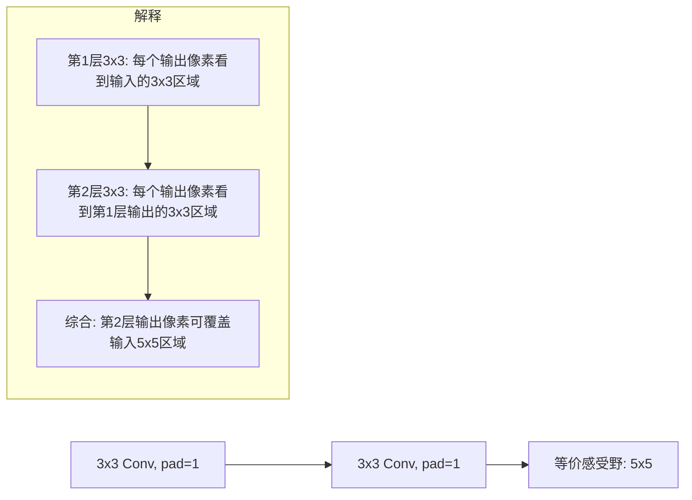

# VGG-11/13/16/19 (2015)

## 论文来源

Simonyan, K. & Zisserman, A. (2015). *Very Deep Convolutional Networks for Large-Scale Image Recognition*. ICLR.

**历史地位**: 证明了**深度**对 CNN 性能至关重要。通过统一使用 3×3 卷积，将网络深度推至 16-19 层，在 ImageNet 2014 上获得 top-5 错误率 7.3%（VGG16）。

---

## 核心哲学：仅 3×3

VGG 最重要的设计决策：**全部使用 3×3 卷积核，步长 1，padding 1**。空间分辨率缩减完全由 MaxPool(2×2, stride=2) 负责。

### 为什么两个 3×3 优于一个 5×5？

两个堆叠的 3×3 卷积的感受野等价于一个 5×5 卷积：

| 方案 | 感受野 | 参数量（假设 C 通道） | 非线性层数 |
|------|--------|---------------------|-----------|
| 单个 5×5 卷积 | 5×5 | $C \times (5 \times 5 \times C) = 25C^2$ | 1 |
| 两个 3×3 卷积 | 5×5 | $C \times (9C) + C \times (9C) = 18C^2$ | 2 |

**两个 3×3 = 参数量减少 28%，多一层非线性，同感受野！**

同理，三个 3×3 堆叠等价于一个 7×7 卷积（参数更少、非线性更多）。



---

## 四变体架构对比

```
输入: (B, 3, 224, 224)

Stage 1: [vgg_conv × N1] (64ch)  ──→ MaxPool(2×2) ──→ (B, 64, 112, 112)
Stage 2: [vgg_conv × N2] (128ch) ──→ MaxPool(2×2) ──→ (B, 128, 56, 56)
Stage 3: [vgg_conv × N3] (256ch) ──→ MaxPool(2×2) ──→ (B, 256, 28, 28)
Stage 4: [vgg_conv × N4] (512ch) ──→ MaxPool(2×2) ──→ (B, 512, 14, 14)
Stage 5: [vgg_conv × N5] (512ch) ──→ MaxPool(2×2) ──→ (B, 512, 7, 7)

Flatten ──→ (B, 25088)
FC1: Linear(25088→4096) + BN1d + ReLU + Dropout ──→ (B, 4096)
FC2: Linear(4096→4096) + BN1d + ReLU + Dropout ──→ (B, 4096)
Output: Linear(4096→num_classes) ──→ (B, num_classes)
```

各变体仅在 `[N1, N2, N3, N4, N5]` 上不同：

| 变体 | N1 | N2 | N3 | N4 | N5 | 总卷积层 | 总权重层 |
|------|----|----|----|----|-----|---------|---------|
| VGG11 | 1 | 1 | 2 | 2 | 2 | 8 | 11 |
| VGG13 | 2 | 2 | 2 | 2 | 2 | 10 | 13 |
| VGG16 | 2 | 2 | 3 | 3 | 3 | 13 | 16 |
| VGG19 | 2 | 2 | 4 | 4 | 4 | 16 | 19 |


---

## VGG16 逐层详解（代表性变体）

### Stage 1 — 64 通道

```
vgg_conv(3→64)   → (B, 64, 224, 224)  参数: 3×3×3×64 + 64 = 1,792
vgg_conv(64→64)  → (B, 64, 224, 224)  参数: 3×3×64×64 + 64 = 36,928
MaxPool(2×2)      → (B, 64, 112, 112)
```

### Stage 2 — 128 通道

```
vgg_conv(64→128)  → (B, 128, 112, 112)  参数: 3×3×64×128 + 128 = 73,856
vgg_conv(128→128) → (B, 128, 112, 112)  参数: 3×3×128×128 + 128 = 147,584
MaxPool(2×2)       → (B, 128, 56, 56)
```

### Stage 3 — 256 通道

```
vgg_conv(128→256) → (B, 256, 56, 56)   参数: 3×3×128×256 + 256 = 295,168
vgg_conv(256→256) → (B, 256, 56, 56)   参数: 3×3×256×256 + 256 = 590,080
vgg_conv(256→256) → (B, 256, 56, 56)   参数: 3×3×256×256 + 256 = 590,080
MaxPool(2×2)       → (B, 256, 28, 28)
```

### Stage 4 — 512 通道

```
vgg_conv(256→512) → (B, 512, 28, 28)   参数: 3×3×256×512 + 512 = 1,180,160
vgg_conv(512→512) → (B, 512, 28, 28)   参数: 3×3×512×512 + 512 = 2,359,808
vgg_conv(512→512) → (B, 512, 28, 28)   参数: 3×3×512×512 + 512 = 2,359,808
MaxPool(2×2)       → (B, 512, 14, 14)
```

### Stage 5 — 512 通道

```
vgg_conv(512→512) → (B, 512, 14, 14)   参数: 3×3×512×512 + 512 = 2,359,808
vgg_conv(512→512) → (B, 512, 14, 14)   参数: 3×3×512×512 + 512 = 2,359,808
vgg_conv(512→512) → (B, 512, 14, 14)   参数: 3×3×512×512 + 512 = 2,359,808
MaxPool(2×2)       → (B, 512, 7, 7)
```

### 分类器

```
Flatten            → (B, 25088)
FC1: 25088→4096 + BN + ReLU + Dropout  参数: 102,764,544 + 8,192 = 102,772,736
FC2: 4096→4096 + BN + ReLU + Dropout   参数: 16,777,216 + 8,192 = 16,785,408
Output: 4096→num_classes               参数: 4096×1000 + 1000 = 4,097,000
```

---

## 参数量对比（ImageNet 1000 类）

| 变体 | Conv 参数 | FC 参数 | 总参数 |
|------|----------|---------|--------|
| VGG11 | ~9.2M | ~123M | ~133M |
| VGG13 | ~9.5M | ~123M | ~133M |
| VGG16 | ~14.7M | ~123M | ~138M |
| VGG19 | ~20.0M | ~123M | ~144M |

**关键洞察**: 四个变体的 FC 层参数完全相同（~123M）！VGG 的参数量增长完全来自卷积层的加深。FC 层参数 ≈ 整个 VGG11 总参数的 92%。

对于 CIFAR-10（10 类），Output 层参数从 4M 降至 41K，总参数约 134M（VGG16）。

<div style="max-width:520px;margin:1em auto;font-size:13px;line-height:1.8;">
  <div style="text-align:center;font-weight:600;margin-bottom:8px;">VGG 各变体参数量对比 (ImageNet 1000 类)</div>
  <div style="display:flex;align-items:center;">
    <span style="width:70px;text-align:right;margin-right:8px;flex-shrink:0;">VGG11</span>
    <span style="height:14px;background:#3498db;width:88.67%;display:inline-block;border-radius:2px;min-width:2px;"></span>
    <span style="margin-left:6px;flex-shrink:0;">133M</span>
  </div>
  <div style="display:flex;align-items:center;">
    <span style="width:70px;text-align:right;margin-right:8px;flex-shrink:0;">VGG13</span>
    <span style="height:14px;background:#3498db;width:88.67%;display:inline-block;border-radius:2px;min-width:2px;"></span>
    <span style="margin-left:6px;flex-shrink:0;">133M</span>
  </div>
  <div style="display:flex;align-items:center;">
    <span style="width:70px;text-align:right;margin-right:8px;flex-shrink:0;">VGG16</span>
    <span style="height:14px;background:#3498db;width:92%;display:inline-block;border-radius:2px;min-width:2px;"></span>
    <span style="margin-left:6px;flex-shrink:0;">138M</span>
  </div>
  <div style="display:flex;align-items:center;">
    <span style="width:70px;text-align:right;margin-right:8px;flex-shrink:0;">VGG19</span>
    <span style="height:14px;background:#3498db;width:96%;display:inline-block;border-radius:2px;min-width:2px;"></span>
    <span style="margin-left:6px;flex-shrink:0;">144M</span>
  </div>
</div>

---

## 关键设计决策

### 1. 通道数翻倍策略

每次 MaxPool 将空间尺寸减半后，下一 stage 的通道数翻倍：

```
通道:  3 → 64 → 128 → 256 → 512 → 512
空间: 224 → 112 → 56 → 28 → 14 → 7
```

这保持了各层的计算量大致均衡——空间减少四倍，但通道数翻倍，总体计算量减半。

### 2. BN 的添加

原始 VGG 论文没有使用 BatchNorm（BN 在 2015 年 ICLR 同期才被提出）。本项目在所有 `vgg_conv` 和 `linear_block` 中添加了 BN，使训练更稳定、收敛更快。

### 3. Dropout = 0.5

VGG 的 FC 层拥有 123M+ 参数，极易过拟合。0.5 的 Dropout 是最强力的正则化手段。

### 4. 权重初始化

```python
# Conv: Kaiming normal (考虑 ReLU 非线性)
nn.init.kaiming_normal_(m.weight, mode="fan_out", nonlinearity="relu")
# BatchNorm: gamma=1, beta=0
nn.init.constant_(m.weight, 1)
nn.init.constant_(m.bias, 0)
# Linear: normal(0, 0.01) — 匹配原始 VGG 论文
nn.init.normal_(m.weight, mean=0, std=0.01)
```

---

## 感受野计算（VGG16）

使用递推公式 $r_{out} = r_{in} + (k - 1) \times \prod s_{prev}$：

| Stage | 层 | 核大小 | 步长 | 累积步长积 | 感受野 |
|-------|----|--------|------|-----------|--------|
| — | 输入 | — | — | — | 1 |
| 1 | 2×conv3 + pool | 3 | 1→1→2 | 1 | 5→7→14 |
| 2 | 2×conv3 + pool | 3 | 1→1→2 | 2 | 18→22→30 |
| 3 | 3×conv3 + pool | 3 | 1→1→1→2 | 4 | 38→46→54→62 |
| 4 | 3×conv3 + pool | 3 | 1→1→1→2 | 8 | 78→94→110→126 |
| 5 | 3×conv3 + pool | 3 | 1→1→1→2 | 16 | 158→190→222→254 |

> VGG16 的最后一层卷积的感受野约为 254×254——远超 224×224 的输入尺寸！网络有能力"看到"整个输入图像甚至更大的上下文。

---

## VGG 的优缺点

### 优点

- **设计极简**: 仅 3×3 卷积 + MaxPool + FC，非常容易理解和实现
- **特征提取能力强**: 预训练的 VGG16 仍是广泛使用的特征提取器（迁移学习、风格迁移）
- **深度可配置**: 同一架构只需改配置即可生成 11/13/16/19 层变体

### 缺点

- **参数量巨大**: FC 层占据 ~123M 参数（90% 总参数），训练和推理成本高
- **内存消耗大**: 存储中间激活需要大量显存
- **容易过拟合**: 在小数据集上需要强正则化

---

## 代码结构

**源码**: [cnnlib/models/vgg.py](https://github.com/NayukiChiba/ALL-CNN/blob/main/cnnlib/models/vgg.py)

```
_VGG (基类)
  ├── _make_stage(): 动态构建 [vgg_conv × N + MaxPool]
  ├── _initWeights(): Kaiming (Conv) + Normal (Linear)
  └── forward(): features → flatten → classifier

VGG11/VGG13/VGG16/VGG19 仅修改 config 参数
```

```python
VGG_CONFIGS = {
    "11": [1, 1, 2, 2, 2],
    "13": [2, 2, 2, 2, 2],
    "16": [2, 2, 3, 3, 3],
    "19": [2, 2, 4, 4, 4],
}

# 创建 VGG16:
model = create_model("vgg16", num_classes=1000, device="cuda")
```

---

## 训练建议

- **推荐数据集**: CIFAR-100, Caltech-101, Flowers-102（中等规模 RGB 数据集）
- **GPU 必需**: 138M 参数无法在 CPU 上高效训练
- **小数据集**: 建议降低 `dropout=0.5`，使用较小的 batch size
- **迁移学习**: VGG 预训练模型可用作特征提取器（本项目不提供预训练权重）

---

## 相关文档

- [各层公式与设计原理](/math/layers) — BatchNorm/ReLU/MaxPool 公式
- [Kaiming & Xavier 初始化](/math/initialization) — Kaiming 初始化推导
- [Dropout](/math/dropout) — Dropout 正则化
- [感受野计算](/math/receptive-field) — 递推公式 + 两 3×3 = 5×5 证明
- [参数量计算](/math/parameter-count) — 详细逐层分解
